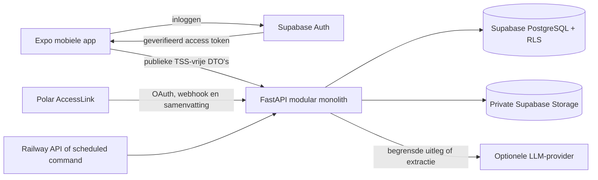
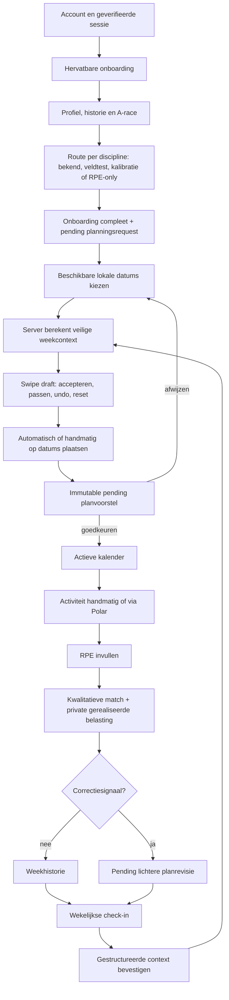

# Start23 - systeemoverzicht, werking en business rules

- Documentstatus: actuele implementatiedocumentatie
- Peildatum: 3 september 2026
- Referentie: `docs/Start23_Systeemoverzicht_BR.pdf`
- Productnaam in de huidige mobiele interface: **Wombo**; technische projectnaam: **Start23**

## Doel en leeswijzer

Dit document beschrijft wat de huidige applicatie daadwerkelijk doet. Per onderdeel staat:

1. wat de atleet ziet of doet;
2. wat de backend uitvoert;
3. welke berekening of beslisregel wordt gebruikt;
4. welke high-level product- of architectuurbeslissing daarachter zit;
5. waar dit afwijkt van `Start23_Systeemoverzicht_BR.pdf`.

Formules staan in wiskundige notatie. De uitleg eromheen gebruikt bewust gewone mensentaal. Geplande en gerealiseerde Training Stress Score (TSS) worden in dit document uitgelegd omdat ze intern deel uitmaken van het systeem. De mobiele app en publieke API mogen die waarden nooit tonen.

Statusaanduidingen in dit document:

- **Geïmplementeerd**: aantoonbaar aanwezig in de huidige code.
- **Gedeeltelijk**: een veilige subset bestaat, maar een beschreven positieve route of externe verificatie ontbreekt.
- **Niet geïmplementeerd**: ontwerpintentie zonder actieve productwerking.
- **Fail-closed**: het systeem stopt of houdt informatie verborgen als een goedgekeurde regel of betrouwbare invoer ontbreekt.

## Inhoud

- [1. Systeemoverzicht](#1-systeemoverzicht)
- [2. Actoren en verantwoordelijkheden](#2-actoren-en-verantwoordelijkheden)
- [3. Begrippenlijst](#3-begrippenlijst)
- [4. Algemene business rules](#4-algemene-business-rules)
- [5. End-to-endflow](#5-end-to-endflow)
- [6. Authenticatie en sessie](#6-authenticatie-en-sessie)
- [7. Onboarding en nulmeting - UC-01](#7-onboarding-en-nulmeting---uc-01)
- [8. Trainingsplanner - UC-02](#8-trainingsplanner---uc-02)
- [9. Trainingsuitvoering en feedback - UC-03](#9-trainingsuitvoering-en-feedback---uc-03)
- [10. Wekelijkse evaluatie - UC-04](#10-wekelijkse-evaluatie---uc-04)
- [11. Zones, tests en kalibratie - UC-05](#11-zones-tests-en-kalibratie---uc-05)
- [12. Polar-integratie](#12-polar-integratie)
- [13. Mobiele schermen](#13-mobiele-schermen)
- [14. Trainingscatalogus](#14-trainingscatalogus)
- [15. API-overzicht](#15-api-overzicht)
- [16. Data, security en privacy](#16-data-security-en-privacy)
- [17. Beslisvolgorde](#17-beslisvolgorde)
- [18. Rekenvoorbeelden](#18-rekenvoorbeelden)
- [19. Belangrijkste verschillen met de referentie-PDF](#19-belangrijkste-verschillen-met-de-referentie-pdf)
- [20. Implementatiestatus en open grenzen](#20-implementatiestatus-en-open-grenzen)
- [21. Technische bronverwijzingen](#21-technische-bronverwijzingen)

---

## 1. Systeemoverzicht

### 1.1 Doel van Start23

Start23 ondersteunt een atleet bij het opbouwen, kiezen, plannen en evalueren van zwem-, fiets- en looptrainingen. Het systeem combineert:

- een deterministische fysiologische rekenkern;
- een versievaste trainingscatalogus;
- een mobiele Expo-app;
- Supabase voor identiteit, database en private opslag;
- FastAPI als enige backend voor domeinlogica;
- een optionele LLM-laag die tekst structureert en beslissingen uitlegt;
- Polar AccessLink als huidige wearable-integratie.

De kernbelofte is: **de software rekent en adviseert, de atleet beslist**. Een systeemgegenereerde wijziging aan een actief plan of actieve zones wordt eerst een voorstel. Alleen expliciete goedkeuring kan zo'n voorstel toepassen.

### 1.2 Actuele architectuur

De backend is één **modulaire monoliet**: één applicatie en één deployment, intern verdeeld in modules voor onboarding, workouts, planning, activiteiten, check-ins, kalibratie, integraties, fysiologie en coaching.

### 1.3 High-level beslissingen

- Fysiologische beslissingen staan in pure, deterministische Python-functies.
- De LLM heeft geen mutatietools en berekent geen zones of plannen.
- De mobiele client ontvangt geen service-role key, databasewachtwoord, LLM-sleutel of interne TSS.
- Planning schrijft een lokale kalenderdatum voor, geen verplicht trainingstijdstip.
- Ontbrekende regels of data leiden tot een veilige stop of een pending voorstel, niet tot een verzonnen uitkomst.
- Microservices, Celery, Redis, TimescaleDB en Kubernetes horen niet bij de huidige architectuur.

---

## 2. Actoren en verantwoordelijkheden

### 2.1 Atleet

De atleet registreert een account, vult het profiel en trainingsverleden in, kiest een doel en stelt per discipline de begeleidingsroute in. Daarna kiest de atleet trainingen, plant deze op beschikbare dagen, registreert uitgevoerde activiteiten en geeft een RPE-score. De atleet bevestigt of verwerpt ieder kritiek systeemvoorstel.

High-level beslissing: autonomie is een systeemgrens, geen alleenstaande UI-belofte.

### 2.2 Deterministische engine

De deterministische engine:

- valideert invoer;
- berekent interne belasting, progressie, herstel en taper;
- filtert de catalogus;
- controleert blessures, zones, beschikbaarheid en anti-stapeling;
- maakt immutable planrevisies en voorstellen;
- classificeert activiteitfeedback;
- berekent testresultaten en zonegrenzen.

High-level beslissing: dezelfde invoer en rulesetversie moeten dezelfde uitkomst geven.

### 2.3 LLM-coach

De LLM-coach heeft twee beperkte taken:

1. vrije tekst uit een check-in omzetten in een **tijdelijk invulvoorstel**;
2. een al berekend weekvoorstel in gewone taal uitleggen.

De LLM ontvangt alleen een gesloten schema, gebruikt geen tools, bewaart de providerrequest niet (`store: false`) en kan geen planning of zones toepassen. Bij een fout neemt een lokale, deterministische tekstfallback over.

### 2.4 Wearableplatform

Polar is momenteel het enige geïmplementeerde wearableplatform. Polar levert activiteitsamenvattingen en optioneel een FIT-bestand. De samenvatting wordt naar het canonieke activiteitenmodel vertaald. Het FIT-bestand kan privaat worden opgeslagen, maar wordt in de huidige flow niet gebruikt om ruwe tijdreeksen of TSS-formules te berekenen.

### 2.5 Supabase

Supabase levert authenticatie, PostgreSQL, Row Level Security (RLS), databasefuncties en private objectopslag. Publieke owner-acties gebruiken de identiteit uit het geverifieerde access token. Gevoelige interne belasting wordt via smalle service-only databasefuncties verwerkt.

### 2.6 Railway

Railway is het deploymentdoel voor de FastAPI-app en kan dezelfde applicatieservices via geplande commando's aanroepen, bijvoorbeeld voor retries. Er is geen afzonderlijke workerarchitectuur vereist.

---

## 3. Begrippenlijst

| Begrip | Betekenis in mensentaal |
|---|---|
| **API** | De afgesproken digitale ingang waarmee de mobiele app met de backend praat. |
| **BPM** | Beats per minute: het aantal hartslagen per minuut. |
| **Bucket / emmer** | Eén van twee categorieën voor de tijdsverdeling: rustig (`low`) of intensief (`high`). |
| **CSS** | Critical Swim Speed: het zwemtempo dat als drempelreferentie wordt gebruikt, opgeslagen als seconden per 100 meter. Minder seconden betekent sneller en dus intensiever. |
| **DTO** | Data Transfer Object: een strikt gedefinieerd pakket gegevens dat via de API mag worden verstuurd. |
| **FTP** | Functional Threshold Power: een benadering van het fietsvermogen dat ongeveer rond de functionele drempel kan worden volgehouden, uitgedrukt in watt. |
| **Hartslagreserve / HRR** | Het verschil tussen geschatte maximale hartslag en rusthartslag. |
| **HRmax** | Geschatte of gemeten maximale hartslag. |
| **HRrest** | Rusthartslag, idealiter gemeten in rust. |
| **HMAC** | Een cryptografische controle waarmee de backend verifieert dat een webhook echt met het gedeelde geheim is ondertekend. |
| **Idempotent** | Dezelfde geldige request opnieuw uitvoeren geeft geen dubbel object of dubbele activiteit. |
| **Intensiteitsdekking** | Het deel van de gerealiseerde duur waarvoor een lage of hoge intensiteitscategorie bekend is. |
| **LLM** | Large Language Model: taalmodel voor begrensde tekstextractie en uitleg, niet voor fysiologische besluitvorming. |
| **LTHR** | Lactate Threshold Heart Rate: hartslag rond de loopdrempel, uitgedrukt in BPM. |
| **Macrocyclus** | De lange trainingsperiode richting een hoofddoel of wedstrijd. |
| **Mesocyclus** | Een kleiner trainingsblok. Start23 gebruikt vier opbouwweken en daarna één herstelweek. |
| **OAuth** | Veilige koppelprocedure waarbij Polar toestemming krijgt zonder dat Start23 het Polar-wachtwoord ontvangt. |
| **Pending** | In afwachting. Het voorstel bestaat, maar is nog niet actief. |
| **RLS** | Row Level Security: databaseregels die zorgen dat een atleet alleen eigen rijen kan lezen of wijzigen. |
| **RPE** | Rating of Perceived Exertion: de door de atleet ervaren zwaarte op een schaal van 1 tot 10. Start23 gebruikt in zijn zonebegeleiding vooral 2 tot en met 10. |
| **Ruleset** | Een versieerbare verzameling goedgekeurde reken- en beslisregels. |
| **Smart rest day** | Een dag binnen de planweek waarop bewust geen training staat. |
| **Soft boundary** | Een zachte grens: overschrijding geeft een waarschuwing of voorstel, geen stille mutatie. |
| **Swipe draft** | Een server-opgeslagen concept waarin de atleet trainingskaarten accepteert, passeert en op dagen plaatst. |
| **Taper** | Geplande afbouw van trainingsbelasting voor een wedstrijd. |
| **TSS** | Training Stress Score: interne maat voor trainingsbelasting. In Start23 is dit een afgeschermde serverwaarde; de precieze berekening verschilt per gegevensbron. |
| **pTSS** | Planned TSS: vooraf vastgelegde of berekende interne belasting van een geplande training. |
| **rTSS** | Realized TSS: intern afgeleide belasting van een uitgevoerde training. In de huidige canonieke activiteitflow is dit RPE maal duur in uren. |
| **Zone 1-5** | Vijf oplopende intensiteitsniveaus. Zone 1 is het rustigst; Zone 5 het zwaarst. Bij tempo in seconden is de getalsrichting omgekeerd: minder seconden is sneller. |

### 3.1 RPE-zones in de app

| Zone | RPE | Algemeen gevoel |
|---|---:|---|
| Zone 1 | 2-3 | Zeer rustig herstel; praten en vaak zingen lukt. |
| Zone 2 | 4 | Comfortabel duurtempo; volledige zinnen zijn mogelijk. |
| Zone 3 | 5-6 | Stevig tempo; praten lukt alleen in kortere zinnen. |
| Zone 4 | 7-8 | Zwaar drempelwerk; praten lukt vrijwel niet. |
| Zone 5 | 9-10 | Zeer zwaar tot maximaal; alleen korte inspanningen. |

De beschrijving wordt per sport aangepast. Bijvoorbeeld: Zone 1 heet bij lopen herstel, bij fietsen losrijden en bij zwemmen inzwemmen.

---

## 4. Algemene business rules

### BR-001 - Volledige autonomie

**Status:** geïmplementeerd.

Wat gebeurt er:

- Een systeemgegenereerd nieuw plan wordt als `pending_approval` opgeslagen.
- Een systeemgegenereerd zoneprofiel wordt als pending voorstel opgeslagen.
- Goedkeuring controleert eigenaar, voorstelstatus en exacte basisrevisie.
- Een verouderd voorstel faalt als conflict en kan niet over nieuwere wijzigingen heen worden toegepast.
- Afwijzen verandert het actieve plan of profiel niet.

Een handmatige kalenderverplaatsing door de geverifieerde atleet is een directe gebruikersactie. Die kan onmiddellijk een nieuwe actieve revisie maken, mits de week- en blessuregrenzen geldig zijn. Eventuele anti-stackuitkomsten blijven waarschuwingen.

High-level beslissing: systeeminitiatieven zijn pending; expliciete, geldige gebruikersacties mogen direct zijn.

Verschil met de PDF: de PDF beschrijft autonomie op hoofdlijnen. De implementatie voegt immutable revisies, optimistic concurrency en stale checks toe.

### BR-002 - Zachte grenzen en fysiologische schuld

**Status:** geïmplementeerd, met een veilige escalatieroute.

Een volumeoverschrijding activeert pas wanneer de gerealiseerde interne weekbelasting strikt groter is dan 110% van de geplande belasting:

\[
L_{\mathrm{realized},t-1} > 1.10\,L_{\mathrm{planned},t-1}
\]

De schuld en het gecorrigeerde doel zijn:

\[
D_V = L_{\mathrm{realized},t-1} - L_{\mathrm{planned},t-1}
\]

\[
L_{\mathrm{target},t}
= 1.10\,L_{\mathrm{planned},t-1} - D_V
\]

Als deze uitkomst nul of negatief is, publiceert de planner geen normaal doel. De eerste keer maakt hij een pending herstelvoorstel op basis van de herstelregel. Een herhaling vanuit zo'n manual-reviewherstel stopt met een escalatiefout voor gekwalificeerde beoordeling.

Intensiteitsschuld gebruikt tijd, niet TSS. Eerst wordt datakwaliteit gecontroleerd:

\[
C = \frac{T_{\mathrm{classified}}}{T_{\mathrm{realized}}}
\]

Alleen bij \(C \ge 0.60\) wordt de gerealiseerde hoge fractie betrouwbaar genoeg gevonden. Daarna:

\[
D_I = \max\left(0,
\frac{T_{\mathrm{high,realized}}}{T_{\mathrm{classified}}}
- \frac{T_{\mathrm{high,planned}}}{T_{\mathrm{planned}}}
\right)
\]

\[
f_{\mathrm{high,next}} = \max(0.05,\;0.20-D_I)
\]

De algemene rekenfunctie ondersteunt een bodem van 0% voor een bevestigde blessurecontext. De huidige weekplanner gebruikt voor de globale ratio standaard de 5%-bodem; geblokkeerde disciplines worden afzonderlijk verwijderd.

High-level beslissing: alleen betrouwbare, geclassificeerde tijd mag een intensiteitscorrectie sturen. Onbekende tijd wordt niet automatisch als rustig of zwaar geïnterpreteerd.

Verschil met de PDF: de PDF formuleert de volumeschuld vergelijkbaar, maar noemt elke overschrijding boven 10%. De code gebruikt de exacte grens **strikt boven 110%**. De implementatie voegt een 60%-datadekkingspoort en manual-reviewpad toe.

### BR-003 - Tijdgebaseerde 80/20-verdeling

**Status:** geïmplementeerd voor het racegerichte model.

De standaarddoelverhouding is:

\[
f_{\mathrm{low}}=0.80, \qquad f_{\mathrm{high}}=0.20
\]

In de actieve planner is de catalogusbucket van de **hele training** leidend. De volledige tijd van een training telt dus in `low` of `high`. Voor statische templates wordt de dominante segmenttijd gebruikt; een exacte 50/50-verdeling wordt voorzichtig als `high` geclassificeerd. Voor de geïmporteerde broncatalogus is de beoordeelde kolom `Emmer (80/20)` leidend.

De weekverdeling is:

\[
f_{\mathrm{high}} = \frac{\sum T_{\mathrm{high\ workouts}}}
{\sum T_{\mathrm{timed\ workouts}}},
\qquad
f_{\mathrm{low}}=1-f_{\mathrm{high}}
\]

Afstandsgestuurde zwemtrainingen zonder goedgekeurde duur tellen niet mee in deze tijdratio. De app toont daarvoor een informatiewaarschuwing.

Een aparte signaalregel waarschuwt als gerealiseerde intensieve tijd strikt meer dan 130% van de geplande intensieve tijd is:

\[
T_{\mathrm{high,realized}}>1.30\,T_{\mathrm{high,planned}}
\]

High-level beslissing: de broncatalogus is eigenaar van de 80/20-classificatie; de planner verzint geen zwemtijd uit afstand.

Verschil met de PDF: de PDF deelt losse zones direct in emmers in en beschrijft doelafhankelijke verhoudingen zoals 90/10 en 75/25. De huidige planner gebruikt één racegerichte 80/20-doelverhouding, eventueel tijdelijk verlaagd door intensiteitsschuld. Persoonlijke doelmodellen zijn nog niet actief.

### BR-004 - Progressieve belasting en vooraf bepaalde trainingsbelasting

**Status:** geïmplementeerd.

Voor codegedefinieerde templates wordt de interne geplande belasting vastgelegd als het midden van het verwachte sessie-RPE-bereik maal duur in uren:

\[
L_{\mathrm{planned}}
= \frac{RPE_{\min}+RPE_{\max}}{2}
\times\frac{T_{\mathrm{minutes}}}{60}
\]

Voor de 154 geïmporteerde Start23-trainingen wordt de vooraf gedefinieerde TSS uit het bronbestand ongewijzigd als private cataloguswaarde opgeslagen. De planner herberekent die bronwaarde niet.

Reguliere progressie geldt wanneer minstens 80% van de vorige geplande belasting is gerealiseerd:

\[
L_{\mathrm{realized},t-1}\ge0.80\,L_{\mathrm{planned},t-1}
\Rightarrow
L_{\mathrm{target},t}=1.10\,L_{\mathrm{planned},t-1}
\]

Bij minder dan 80% wordt de beschikbare 42-dagenbaseline gebruikt:

\[
B_{42}=\frac{1}{n}\sum_{i=1}^{n}L_i
\]

Hierbij zijn \(L_i\) de beschikbare weekstarts in de laatste 42 kalenderdagen. Voor de reguliere baseline worden herstelweken uitgesloten. Als gerealiseerde data volledig ontbreekt, houdt de planner de vorige geplande belasting vast; ontbrekende data is geen bewijs van naleving of uitval.

Bij een volledig inactieve direct voorafgaande week met nul voltooide activiteiten gebruikt de planner exact de vier recentste complete lokale weken, inclusief de nulweek:

\[
B_{\mathrm{restart}}=\frac{L_{t-1}+L_{t-2}+L_{t-3}+L_{t-4}}{4}
\]

High-level beslissing: progressie ankert aan het veilige plan, niet aan willekeurige overshoot. Een zwaar gemiste week leidt niet tot een abrupte sprong.

Implementatiebevinding: de nieuwe broncatalogus gebruikt vooraf gedefinieerde TSS, terwijl gerealiseerde activiteitbelasting nog met `RPE × duur in uren` wordt berekend. Deze schalen zijn niet aantoonbaar gelijk. Daardoor kan een brontraining bijvoorbeeld intern 36 geplande punten hebben, terwijl 60 minuten met RPE 4 vier gerealiseerde punten oplevert. Bron-pTSS en RPE-rTSS mogen niet in progressie of de matchmatrix worden vergeleken voordat een expliciete normalisatie- of migratiebeslissing is genomen.

Verschil met de PDF: de PDF spreekt over CTL als doorgaans 42 dagen. De code gebruikt een rekenkundig gemiddelde van beschikbare **weeksnapshots** binnen 42 dagen, geen dagelijkse exponentieel gewogen CTL-formule.

### BR-005 - Verborgen TSS en onbeïnvloede RPE

**Status:** geïmplementeerd en contractueel getest.

Interne geplande en gerealiseerde belasting staat in private tabellen of interne modellen. Publieke Pydantic-modellen, OpenAPI, mobiele types, waarschuwingen en LLM-prompts bevatten die waarden niet. De app toont duur, afstand, discipline, zone/RPE-instructie en kwalitatieve signalen.

High-level beslissing: de atleet beoordeelt het gevoel van de training zonder door een theoretisch stressgetal te worden gestuurd.

Verschil met de PDF: de intentie is gelijk. De implementatie maakt de grens expliciet in afzonderlijke publieke modellen en recursieve contracttests.

### BR-006 - Anti-stack of anti-stapeling

**Status:** geïmplementeerd.

Alleen trainingen uit de hoge-intensiteitsemmer tellen mee. De regel wordt per discipline gecontroleerd:

- lopen: minimaal 72 werkelijk verstreken uren;
- fietsen: minimaal twee volledige lokale rustdatums tussen beide trainingen;
- zwemmen: minimaal twee volledige lokale rustdatums tussen beide trainingen.

Voor datumgebaseerde planning projecteert de backend een trainingsdatum intern op 12:00 lokale tijd om de 72-uursregel stabiel te kunnen vergelijken. Dat middaguur is geen voorgeschreven trainingstijd.

Bij automatisch genereren is een schending een harde planningsbeperking: de planner zoekt een andere indeling of faalt veilig. Bij een directe handmatige verplaatsing door de atleet is dezelfde uitkomst een kwalitatieve waarschuwing.

High-level beslissing: de gegenereerde planning moet veilig zijn; de atleet behoudt bij een eigen geldige weekwijziging autonomie en krijgt transparante waarschuwing.

Verschil met de PDF: “48 uur” voor fiets en zwem is verduidelijkt tot **twee volledige lokale rustdatums**, waardoor zomer-/wintertijd en datumplanning geen ambigu gedrag geven.

### BR-007 - 4+1-mesocyclus en herstelweek

**Status:** geïmplementeerd.

Vier opbouwweken worden gevolgd door één herstelweek. Voor een race wordt de positie achterwaarts vanaf de A-race bepaald. Taper heeft voorrang op een herstelweek.

Het standaard hersteldoel is:

\[
L_{\mathrm{recovery}}=0.60\,L_{\mathrm{previous\ planned}}
\]

De pure regel accepteert alleen een vooraf goedgekeurde factor tussen 0,40 en 0,60. De planner gebruikt standaard 0,60.

Na expliciet gemarkeerde doelrealisatie gaat het systeem naar onderhoud: opbouwweken houden de laatste goedgekeurde baseline vast en iedere vijfde week is herstel. De 10%-groei stopt in onderhoud.

High-level beslissing: een racedoel bepaalt de kalender achterwaarts; onderhoud gebruikt een vooruitlopende 4+1-cyclus zonder verdere groei.

Verschil met de PDF: de PDF noemt een verplichte 60%-week. De implementatie modelleert tevens een goedgekeurd 40%-60%-bereik en laat taper voorgaan.

### BR-008 - Taper

**Status:** taperformules geïmplementeerd, met een bekende afwijking in de runtimekoppeling van de raceweek; B/C bestaan als domeinregel maar zijn niet bereikbaar via het huidige ene A-race-productmodel.

De taperbaseline is het gemiddelde van beschikbare niet-herstelweken in de laatste 42 dagen:

\[
B_{\mathrm{taper}}=\frac{1}{n}\sum_{i=1}^{n}L_{i,\mathrm{build}}
\]

Voor een A-race:

\[
L_{T-2}=0.60\,B_{\mathrm{taper}}
\]

\[
L_{T-1}=0.35\,B_{\mathrm{taper}}
\]

De huidige planner koppelt deze twee factoren aan `weeks_before_race == 2` en `weeks_before_race == 1`, gemeten ten opzichte van de maandag van de raceweek. Daardoor krijgt de kalenderweek die de race zelf bevat (`weeks_before_race == 0`) op dit moment niet de 35%-taperfactor. Door de achterwaartse 4+1-berekening komt die week in de huidige code als herstelweek uit. Dit is een feitelijke implementatieafwijking die vóór productie inhoudelijk moet worden beoordeeld; dit document presenteert dit niet als gewenst fysiologisch gedrag.

De domeinlaag definieert voor een B-race een weekfactor van 0,50 en voor een C-race geen taper. Bij overlappende races zou de hoogste prioriteit winnen, daarna de vroegste datum en daarna een stabiel ID.

High-level beslissing: zonder geldige buildbaseline wordt geen taperdoel verzonnen.

Verschil met de PDF: de PDF noemt de 35%-factor voor de raceweek, terwijl de huidige planner hem aan de week vóór de raceweek koppelt. De PDF noemt voor een B-race bovendien 15% volumedaling in vier dagen; de huidige domeinregel bevat in plaats daarvan een weekfactor van 50%. De mobiele onboarding ondersteunt alleen één A-race. De broncatalogus heeft geen taperlabel; lage brontrainingen zijn daarom niet automatisch taper-eligible.

### BR-009 - Zonebeheer per discipline

**Status:** disciplineprofielen en deterministische zoneberekening geïmplementeerd; automatische maandelijkse upgrades niet geïmplementeerd.

De primaire meeteenheden zijn:

- zwemmen: CSS in seconden per 100 meter;
- fietsen: FTP in watt, optioneel aangevuld met fietsdrempelhartslag in BPM;
- lopen: drempeltempo in seconden per kilometer, optioneel aangevuld met LTHR in BPM.

Voor oplopende metrics, waarbij een hoger getal zwaarder is, worden grenswaarden berekend met:

\[
c_j=\operatorname{round}_{1/2\uparrow}(M\,r_j)
\]

Voor tempo, waarbij minder seconden zwaarder is:

\[
c_j=\operatorname{round}_{1/2\uparrow}\left(\frac{M}{r_j}\right)
\]

Hier is \(M\) de drempelwaarde en `round` afronding op een hele eenheid met halve waarden naar boven.

| Metric | Ratio's voor de vier overgangen |
|---|---|
| Fiets-FTP | 0,56; 0,76; 0,91; 1,06 |
| Fiets- of loopdrempelhartslag | 0,85; 0,90; 0,95; 1,03 |
| Loopdrempeltempo of zwem-CSS | 0,78; 0,88; 0,95; 1,02 |

Voor oplopende metrics gelden de intervallen `[onder, boven)`, waarbij Zone 5 open eindigt. Voor tempo gelden omgekeerde intervallen: een gedeelde grens hoort altijd bij de fysiologisch intensievere zone. FTP boven 120% van de drempel krijgt bovendien een `supramaximal`-markering.

High-level beslissing: één profiel heeft vijf aaneengesloten zones, is versieerbaar, bevat broninformatie en wordt nooit stil overschreven.

Verschil met de PDF: de PDF definieert alleen de disciplines en globale metrics. De huidige code voegt concrete, versievaste Zone 1-5-ratio's, afronding, grensbezit, historie en pending goedkeuring toe.

### BR-010 - Blessures en functionele beperkingen

**Status:** geïmplementeerd met **nul automatische herverdeling**.

Start23 stelt geen diagnose. Het legt per discipline een functionele toestand vast:

- vrij;
- zelf gemeld beperkt: alleen lage intensiteit;
- zelf gemeld geblokkeerd;
- professioneel beperkt;
- hervatting vereist expliciete bevestiging;
- verlopen/herbeoordeling nodig.

Een zelf gemelde beperking krijgt na zeven dagen een herbeoordelingsmoment, maar wordt nooit automatisch opgeheven. Professioneel advies moet samen met een herleidbare bron en datum worden opgeslagen.

De actieve MVP-regel is:

\[
L_{\mathrm{redistributed}}=0
\]

Geblokkeerde disciplines verdwijnen uit het voorstel. Een `low_only`-discipline behoudt alleen rustige trainingen. Als alle doeldisciplines geblokkeerd zijn, ontstaat een pending voorstel met uitsluitend rust.

Er bestaat nog een analytische, niet-actieve 80%-herverdelingsfunctie:

\[
L_{\mathrm{analytical\ redistribution}}=0.80\,L_{\mathrm{removed}}
\]

Die functie mag de huidige MVP-planning niet sturen.

High-level beslissing: een blessure mag niet automatisch extra belasting naar andere weefsels of disciplines verplaatsen.

Verschil met de PDF: dit is een bewuste hoofdafwijking. De PDF schrijft 80% herverdeling voor; de huidige, klinisch conservatievere MVP verwijdert de belasting volledig.

---

## 5. End-to-endflow

---

## 6. Authenticatie en sessie

### Wat de gebruiker doet

De gebruiker kiest inloggen of registreren met e-mailadres en wachtwoord. Na registratie kan Supabase, afhankelijk van de projectinstellingen, eerst e-mailbevestiging vereisen.

### Wat het systeem doet

- De mobiele app gebruikt Supabase Auth.
- De app bewaart de sessie en stuurt het access token als Bearer-token naar FastAPI.
- De backend verifieert het token en leidt het gebruikers-ID daaruit af.
- Een client mag nooit zelf een ander athlete-ID kiezen voor een owner-actie.
- Zonder geldige sessie leidt de router terug naar het inlogscherm.

### Berekeningen

Geen fysiologische berekening. De kernbeslissing is identiteitsafleiding:

\[
athlete\_id = subject(verified\_access\_token)
\]

### High-level beslissing

Supabase Auth is de identiteitsbron; FastAPI en RLS bewaken domeintoegang.

### Verschil met de PDF

De PDF begint bij onboarding en beschrijft authenticatie niet als eigen use-case. De implementatie heeft hiervoor wel een expliciete beveiligingsgrens.

---

## 7. Onboarding en nulmeting - UC-01

### 7.1 Doel en trigger

De flow start na een geldige eerste sessie en is hervatbaar. De backend leidt de actuele stap af uit opgeslagen, owner-scoped gegevens; de mobiele app hoeft de voortgang niet als waarheid te bewaren.

### 7.2 Stap 1 - Profiel

De atleet vult in:

- geboortedatum;
- lengte in centimeter;
- gewicht in kilogram;
- rusthartslag in BPM;
- motivatie in vrije tekst;
- optioneel motivatielabel;
- IANA-tijdzone, bijvoorbeeld `Europe/Amsterdam`.

Validatie:

- geboortedatum moet in het verleden liggen;
- numerieke waarden moeten positief zijn;
- de tijdzone moet een bestaande IANA-tijdzone zijn;
- een profielstap is compleet wanneer geboortedatum, lengte, gewicht, rusthartslag en motivatie aanwezig zijn.

Er wordt geen geslacht of fysiologische sekse verzameld of gebruikt.

### 7.3 Stap 2 - Trainingshistorie

Voor zwemmen, fietsen en lopen worden afzonderlijk bevestigd:

- minuten per week;
- ervaringsjaren.

Alle drie disciplines moeten precies één keer voorkomen. De invoer wordt atomair als volledige set vervangen.

Berekening: de huidige eerste week gebruikt **niet** `historische uren × 40`. Trainingshistorie is context, maar de startbelasting komt uit de goedkoopste geldige catalogustraining per vereiste discipline.

### 7.4 Stap 3 - Doel

De huidige uitvoerbare route is één actieve race of evenement met prioriteit A. De atleet geeft:

- titel;
- specifieke beschrijving;
- meetbaar resultaat;
- haalbaarheidsscore 1-10;
- toekomstige doeldatum;
- één tot drie betrokken disciplines.

Algemene fitheid, gewichtsverlies en spieropbouw worden zichtbaar als “komt later”. Ze kunnen geen planning starten omdat de deterministische regels en catalogusdekking nog niet zijn goedgekeurd.

### 7.5 Stap 4 - Begeleidingsroute per discipline

Iedere discipline wordt onafhankelijk ingesteld:

1. **Bekende waarden**: zelf ingevoerd of gemeten door arts/lab. Drempelwaarden worden naar Zone 1-5 omgerekend; optionele handmatige grenzen moeten aaneengesloten en geldig zijn.
2. **Veldtest**: de atleet kiest een beoordeeld maximaal testprotocol en een begeleidingsmetric.
3. **Kalibratieweek**: een submaximaal Week-1-protocol verzamelt observaties zonder direct een drempel te verzinnen.
4. **RPE-only**: trainingen worden zonder numerieke zones op RPE uitgevoerd.

Voor bekende berekende waarden of testuitkomsten blijft een nieuwe zoneversie pending totdat de atleet die expliciet bevestigt. Zonder actief numeriek profiel projecteert de planner zoneblokken naar RPE-instructies en vraagt hij bij de betreffende RPE-workout om gemiddelde hartslag als observatie.

### 7.6 Karvonenfallback

Voor fiets en lopen kan een expliciet bevestigde, ongereviewde hartslagfallback worden gemaakt. Zwemmen heeft geen hartslagfallback voor CSS.

Tanaka-schatting:

\[
HR_{max}=208-0.7\times leeftijd
\]

Hartslagreserve:

\[
HRR=HR_{max}-HR_{rest}
\]

Doelhartslag bij fractie \(q\):

\[
HR_{target}=HR_{rest}+q\times HRR
\]

De vijf banden zijn 50-60%, 60-70%, 70-80%, 80-90% en 90-100% van HRR. Het resultaat krijgt `estimated`, `unreviewed`, `fallback_active` en `needs_testing`-semantiek.

### 7.7 Review en afronden

Onboarding kan worden afgerond wanneer profiel, alle drie historie-items, een A-doel en begeleiding voor alle drie disciplines aanwezig zijn. Afronden maakt idempotent één pending planningsrequest. Het activeert nog geen weekplan.

### High-level beslissingen

- Onboarding is hervatbaar en server-authoritatief.
- Iedere discipline mag een andere begeleidingsroute hebben.
- Persoonlijke doelen blijven zichtbaar maar fail-closed.
- Een theoretische fallback is expliciet herkenbaar en wordt niet als klinisch gevalideerd gepresenteerd.

### Verschillen met de PDF

- Geen A/B/C-doelen; alleen één A-race is actief.
- Geen invoer of berekening voor “andere sporten” tijdens onboarding; externe activiteiten worden wekelijks vastgelegd.
- Geen `uren × 40` start-TSS.
- Geen FTP-schatting uit gewicht en geslacht.
- Piste B is inmiddels actief met aparte veldtest- en kalibratieroutes.
- Polar-koppeling is een apart scherm en geen verplichte afrondingsstap.
- Onboarding maakt een pending planningsrequest, niet onmiddellijk een actief `WeeklyPlan`.

---

## 8. Trainingsplanner - UC-02

### 8.1 Input

De planner gebruikt server-side:

- actieve A-race en betrokken disciplines;
- lokale weekstart op maandag;
- tijdzone;
- actieve zonecapaciteit of RPE-begeleiding per discipline;
- bevestigde blessures en `low_only`-beperkingen;
- bevestigde beschikbare datums;
- private historische plan- en activiteitsbelasting;
- versievaste catalogus en ruleset.

### 8.2 Doel en fase bepalen

De beslisvolgorde is:

1. geldigheid en blessurecontext;
2. taper;
3. herstelweek;
4. fysiologische schuld;
5. reguliere progressie of baseline;
6. intensiteitsverdeling en plaatsing;
7. beschikbaarheid en voorkeuren.

De raceweek wordt naar maandag genormaliseerd. Eén en twee weken voor die week zijn taperweken. Buiten taper is iedere vijfde week achterwaarts vanaf de race een herstelweek.

### 8.3 Catalogus filteren

Een template is alleen geldig als:

- de discipline bij het doel hoort;
- de discipline niet geblokkeerd is;
- de fase bij de training hoort;
- een `low_only`-discipline geen hoge training krijgt;
- benodigde zones of protocollen beschikbaar zijn;
- de fallbackcompatibiliteit klopt;
- een expliciete veldtest alleen via een exacte testdatum binnenkomt.

Bij RPE-only of kalibratie zonder actief profiel worden numerieke zonedoelen in het immutable planningssnapshot vervangen door sport-specifieke RPE-targets. De catalogusbron zelf wordt niet gewijzigd.

### 8.4 Automatische selectie

Zonder expliciete atleetselectie zoekt de planner alle subsets die iedere vereiste discipline minimaal één keer afdekken. De beste subset wordt lexicografisch gekozen op:

1. kleinste absolute afwijking van het interne weekdoel;
2. kleinste afwijking van de gewenste hoge tijdsfractie;
3. kleinste aantal trainingen;
4. stabiele template-ID-volgorde.

In compacte vorm:

\[
\operatorname*{arg\,min}_{S}
\left(
\left|L(S)-L_{target}\right|,
\left|f_{high}(S)-f_{high,target}\right|,
|S|,
IDs(S)
\right)
\]

Deze automatische uitkomst bepaalt ook het vaste aantal en de disciplinecompositie van een swipe draft.

### 8.5 Swipe draft

De server bewaart beslisgeschiedenis, geaccepteerde kaarten, gepasseerde kaarten, actuele kaart, vaste compositie, beschikbaarheid, contextfingerprint en revisie.

- **Accepteren** telt de kaart één keer mee.
- **Passen** verbergt de kaart tot reset.
- **Undo** verwijdert exact de laatste beslissing.
- **Reset passed** maakt gepasseerde kaarten opnieuw beschikbaar zonder accepts te verwijderen.
- Een stale kaart of stale revisie wordt geweigerd.
- De volgende kaart wordt alleen getoond als er vanaf die keuze nog minstens één volledig geldige weekcombinatie bestaat.
- Bij uitputting toont de app herstelacties; de server start geen eindeloze lus.

De 154 geïmporteerde brontrainingen zijn `athlete_selection_only`: ze kunnen als swipekeuze verschijnen, maar bepalen niet zelfstandig de automatische standaardweek.

### 8.6 Plaatsing op kalenderdatums

Na selectie kiest de atleet:

- automatische plaatsing; of
- handmatige plaatsing op bevestigde lokale datums.

Automatische plaatsing:

- sorteert intensieve trainingen eerst;
- probeert de minst gebruikte, daarna vroegste beschikbare datum;
- valideert na iedere toevoeging de volledige anti-stackcombinatie;
- probeert, als de beschikbaarheid dit mogelijk maakt, meer dan drie opeenvolgende rustdagen te vermijden;
- mag meerdere trainingen op één beschikbare dag zetten.

Handmatige plaatsing valideert na iedere gekozen datum opnieuw de volledige week. Iedere geaccepteerde kaart moet een datum hebben voordat handmatig kan worden ingediend.

### 8.7 Pending voorstel en bewerken

Indienen maakt een immutable pending planrevisie en een change proposal. De LLM of lokale fallback voegt alleen een kwalitatieve uitleg toe. Voor goedkeuring kan de atleet:

- een training verwijderen of door een server-goedgekeurd alternatief vervangen;
- de volledige combinatie opnieuw laten valideren;
- het nieuwe voorstel goedkeuren of afwijzen.

Een edit expireert het eerdere voorstel en maakt een nieuwe pending revisie. De actieve kalender verandert pas na goedkeuring.

### 8.8 Actieve kalender en rustdagen

Iedere datum zonder training wordt expliciet als rustdag teruggegeven. Daardoor kan de app onderscheid maken tussen “bewust rust” en “nog geen data”. De kalender toont discipline, duur of afstand, RPE/zone-instructie, status en kwalitatieve waarschuwingen, maar geen TSS.

Een directe verplaatsing:

- moet binnen dezelfde lokale maandag-zondagweek blijven;
- draagt de verwachte revisie mee;
- mag geen harde blessure- of weekregel breken;
- kan een niet-blokkerende anti-stackwaarschuwing opleveren.

### High-level beslissingen

- De server bepaalt geldigheid; mobiele state is nooit de bron van waarheid.
- Beschikbaarheid is datumgebaseerd, niet tijdgebaseerd.
- De catalogus hoeft het doel niet exact te raken; de app meldt kwalitatief dat cataloguscapaciteit afwijkt.
- Een voorstel is pas een plan na expliciete goedkeuring.

### Verschillen met de PDF

- Geen maandagtrigger om 00:01 UTC; weeksemantiek is lokaal en een gebruiker kan expliciet genereren.
- De UI toont geen TSS-budgetbalk of `ΔTSS`.
- Swipe heeft een vast doelaantal en vaste disciplinecompositie; de gebruiker vult niet onbeperkt een emmer.
- De broncatalogus bevat 154, geen 500+ trainingen.
- Automatische plaatsing gebruikt een deterministische zoekprocedure; er is geen aparte voorkeur “zwem nooit naast zwaar lopen” buiten de bestaande anti-stackregels.
- Een automatisch gegenereerde anti-stackschending is hard; een eigen kalenderverplaatsing geeft een waarschuwing.

---

## 9. Trainingsuitvoering en feedback - UC-03

### 9.1 Activiteit aanmaken

Een activiteit kan handmatig of via Polar ontstaan. De canonieke samenvatting bevat discipline, werkelijk starttijdstip met tijdzone, duur, optionele afstand/hoogtemeters en optionele samenvattende metrics. Een idempotency key plus fingerprint voorkomt dubbele import of dubbele handmatige creatie.

De activiteit kan direct aan een geplande Start23-training of een vooraf gemelde externe activiteit worden gekoppeld. De twee zijn wederzijds exclusief.

### 9.2 Voorstel voor koppeling

De mobiele app kan bij een nog ongekoppelde activiteit de dichtstbijzijnde geplande training met dezelfde discipline binnen 24 uur voorstellen. De atleet moet de exacte koppeling bevestigen. De backend controleert eigendom en databasestatus.

High-level beslissing: automatische nabijheid is alleen een UI-suggestie, geen autonome match.

### 9.3 RPE-reminder

Een nieuwe activiteit begint als `awaiting_rpe`. Bij iedere navigatie binnen het ingelogde deel telt de app openstaande RPE-items en toont bovenaan een niet-blokkerende reminder die naar Activiteiten leidt.

### 9.4 Gerealiseerde interne belasting

Na RPE-invoer gebruikt de huidige canonieke flow:

\[
L_{\mathrm{realized}}=RPE_{\mathrm{actual}}\times\frac{T_{\mathrm{actual\ minutes}}}{60}
\]

Bij een toegewezen RPE-gestuurde workout is ook gemiddelde hartslag in BPM vereist. De huidige activiteitservice slaat die observatie op, maar classificeert haar nog niet. Er bestaat wel een pure, geteste observatieregel die een BPM-waarde alleen met een vertrouwde referentie kan vergelijken:

\[
HR_{ref}-10\le HR_{observed}\le HR_{ref}+10
\]

De grenzen zijn inclusief. Deze functie is nog niet aan de productflow gekoppeld. Ook na koppeling mag de uitkomst uitsluitend context zijn en geen zone, drempel of planbesluit maken.

RPE kan alleen binnen de lokale maandag-zondagweek van de activiteit worden gecorrigeerd. Iedere correctie wordt geaudit en de private belasting wordt opnieuw deterministisch berekend.

### 9.5 Matchmatrix

De beslisvolgorde is bewust:

1. ongepland;
2. verborgen vermoeidheid;
3. overshoot;
4. perfecte match;
5. overige afwijking.

| Uitkomst | Voorwaarde | Gevolg |
|---|---|---|
| Ongepland | Geen gekoppelde geplande training | Kwalitatief label en mogelijk pending correctievoorstel. |
| Verborgen vermoeidheid | Geplande training is `low` en werkelijke RPE is minimaal 7 | Herstelsignaal en mogelijk pending correctievoorstel. |
| Overshoot | \(L_{realized}>1.15\,L_{planned}\) | Label “zwaarder dan gepland” en mogelijk pending correctievoorstel. |
| Perfecte match | Belasting ligt inclusief tussen 90% en 110% én RPE ligt in het verwachte bereik | Positieve kwalitatieve terugkoppeling. |
| Afwijking | Geen van bovenstaande | Afwijking wordt geregistreerd zonder automatische correctiereden. |

Verborgen vermoeidheid wordt vóór overshoot beoordeeld, omdat RPE zelf deel is van de gerealiseerde belasting. Anders zou het specifieke signaal bij een rustige training verloren gaan.

### 9.6 Correctie van de lopende week

Bij overshoot, verborgen vermoeidheid of ongeplande belasting kan de database een nieuwe pending planrevisie maken:

- bij verborgen vermoeidheid worden toekomstige intensieve trainingen binnen 72 uur geannuleerd in het voorstel;
- bij overshoot of ongeplande belasting worden toekomstige intensieve trainingen in de betreffende actieve week geannuleerd in het voorstel;
- rustige trainingen blijven staan;
- het actieve plan verandert pas na goedkeuring.

De huidige correctie vervangt trainingen niet automatisch door kortere of rustige sessies.

Voor trainingen uit de nieuwe broncatalogus geldt momenteel dezelfde schaalbevinding als bij BR-004: vooraf gedefinieerde bron-pTSS en RPE-duur-rTSS zijn zonder goedgekeurde normalisatie niet betrouwbaar onderling vergelijkbaar. Dit raakt zowel `perfect_match`/`overshoot` als weekprogressie en is daarom een releaseblokkerende inhoudelijke grens voor die trainingsrijen.

### High-level beslissingen

- RPE blijft verplicht voor de gerealiseerde belastingsberekening.
- Ontbrekende RPE blijft ontbrekend; er wordt geen waarde geschat.
- Activiteitcorrecties zijn immutable, pending en stale-safe.
- Kwalitatieve feedback verlaat de backend; interne load niet.

### Verschillen met de PDF

- Geen normalized-power-TSS, hartslag-TSS of swim-TSS uit FIT/TCX-tijdreeksen.
- De actuele formule is RPE maal werkelijke duur in uren.
- RPE-reminder is prominent maar niet verplicht/blokkerend.
- Geen Pacing Points, XP of gamificatiemodule.
- Correcties annuleren geselecteerde toekomstige intensieve sessies in een pending revisie; ze downgraden niet automatisch.

---

## 10. Wekelijkse evaluatie - UC-04

### 10.1 Check-in starten

De atleet start of hervat een check-in voor een lokale maandag. De check-in is uniek en idempotent per atleet/weekcontext.

### 10.2 Vrije tekst als invulhulp

De atleet kan maximaal 1000 tekens vrije tekst geven. De LLM mag daaruit alleen een tijdelijk, gesloten kandidaatmodel maken met:

- geblokkeerde datums binnen de week;
- mogelijk vermoeidheidsniveau;
- redenen voor gemiste trainingen;
- mogelijk genoemde blessuredisciplines;
- maximaal vijf agendaregels;
- maximaal drie verduidelijkingsvragen.

Deze kandidaat wordt niet opgeslagen of bevestigd. De atleet kiest zelf welke niet-medische velden worden overgenomen en stelt blessurebeperkingen apart in. Bij providerfout verschijnt een lokale verduidelijkingsvraag.

### 10.3 Gestructureerde context

De atleet bevestigt expliciet:

- volledig geblokkeerde datums;
- vermoeidheid: geen, laag, middelmatig of hoog;
- redenen voor gemiste trainingen;
- status per discipline: vrij, alleen rustig, geblokkeerd of professioneel beperkt;
- alarmsymptomenwaarschuwing;
- sport buiten Start23, inclusief tijdstip, discipline, duur, zwaar/licht en terugkerend;
- dat terugkerende activiteiten voor die week zijn gecontroleerd.

De backend canonicaliseert deze inhoud en berekent een SHA-256-fingerprint:

\[
fingerprint=SHA256(canonical\_JSON(context))
\]

Bevestiging moet exact dezelfde revisie en fingerprint noemen. Een latere wijziging vereist een nieuwe bevestiging.

### 10.4 Effect op planning

Beschikbare dagen zijn:

\[
D_{available}=D_{week}\setminus(D_{blocked}\cup D_{strenuous\ external})
\]

Gestructureerde blessurebeperkingen sturen het filter: `blocked` verwijdert de discipline en `low_only` verwijdert intensieve templates.

Belangrijk: vermoeidheidsniveau en redenen voor gemiste trainingen worden momenteel opgeslagen en getoond, maar hebben nog geen afzonderlijke deterministische factor in de weekdoelberekening. Ze mogen daarom niet via de LLM stil het plan veranderen.

Na contextbevestiging maakt de backend één pending weekvoorstel. De atleet kan dit goedkeuren of later beslissen.

### 10.5 Doel behaald en onderhoud

De atleet kan expliciet aangeven op welke niet-toekomstige datum het doel is behaald. Daarna blijft het doel technisch actief in onderhoudsmodus: opbouwweken houden de baseline vast en iedere vijfde week is herstel.

### High-level beslissingen

- Vrije tekst is invulhulp, geen autoriteit.
- Alleen afzonderlijk bevestigde gestructureerde context bereikt de planner.
- Externe zware sport blokkeert de lokale datum voor Start23-planning.
- Een beperking wordt wekelijks opnieuw bekeken en nooit stil opgeheven.

### Verschillen met de PDF

- De LLM analyseert niet zelfstandig TSS/RPE-ratio's in een vrij gesprek.
- De check-in is primair een gestructureerd formulier met optionele extractiehulp.
- Vermoeidheid wordt nog niet via een goedgekeurde rekenregel in volume omgezet.
- Blessurebelasting wordt niet over andere disciplines herverdeeld.

---

## 11. Zones, tests en kalibratie - UC-05

### 11.1 Profielweergave

Het zoneprofielscherm toont per discipline:

- actief profiel;
- volledig pending voorstel;
- immutable eerdere versies;
- bron, bronkwaliteit, rekenmodel en status;
- zichtbare numerieke waarden of de reden waarom die verborgen blijven;
- openstaande testvoorstellen.

### 11.2 Veldtests

#### Lopen - 30 minuten

Protocol: 15 minuten warming-up, 5 minuten strides, 30 minuten test op zware maar beheerste inspanning en 10 minuten cooling-down.

Een drempeltempo kan alleen ontstaan als het testblok compleet, niet onderbroken, kwalitatief voldoende en stabiel is, met gerapporteerde blok-RPE 8-9. Het gemiddelde testtempo wordt afgerond op hele seconden per kilometer.

Als de laatste 20 minuten minimaal 95% hartslagdekking hebben, wordt ook LTHR berekend:

\[
LTHR_{run}=\operatorname{round}_{1/2\uparrow}
(HR_{avg,last\ 20min})
\]

#### Fietsen - FTP-test van 30 minuten

Protocol: 20 minuten warming-up, 30 minuten test en 10 minuten cooling-down. Vereist blok-RPE 8-9, gekalibreerde vermogensbron, stabiel vermogen en minimaal 95% meetdekking.

\[
FTP=\operatorname{round}_{1/2\uparrow}
(0.95\times P_{avg,last\ 20min})
\]

#### Fietsen - drempelhartslagtest van 20 minuten

Protocol: 20 minuten warming-up, 20 minuten test en 10 minuten cooling-down. Vereist blok-RPE 8-9 en minimaal 95% hartslagdekking.

\[
FTHR=\operatorname{round}_{1/2\uparrow}(HR_{avg,test})
\]

#### Zwemmen - CSS 400/200

Protocol: 600 meter warming-up, maximale 400 meter, 5-10 minuten actief herstel, maximale 200 meter en 200 meter cooling-down. Beide testen vereisen RPE 9-10, vrije slag, hetzelfde 25- of 50-meterbad en geen hulpmiddelen.

Met \(T_{400}\) en \(T_{200}\) in seconden:

\[
CSS_{sec/100m}=\operatorname{round}_{1/2\uparrow}
\left(\frac{T_{400}-T_{200}}{2}\right)
\]

De test is ongeldig als \(T_{400}\le T_{200}\) of \(2T_{200}\ge T_{400}\), omdat de onderlinge tempos niet geloofwaardig genoeg zijn voor deze formule.

### 11.3 Test plannen

Een test krijgt altijd een exacte lokale datum, zonder verplicht uur.

- Standalone: apart pending testvoorstel.
- Geïntegreerd in een pending weekplan: vervangt exact één training van dezelfde discipline.
- Zwem-CSS is alleen standalone, omdat voor integratie nog geen goedgekeurde duur/private-loadbehandeling bestaat.

Goedkeuring van een testdatum verandert geen zones. Eerst moet de test worden uitgevoerd en geëvalueerd; daarna volgt nog een aparte drempelbevestiging en vervolgens een zonevoorstel.

### 11.4 Submaximale kalibratie

Week-1-kalibratie gebruikt comfortabele en steady RPE-blokken voor lopen, fietsen of zwemmen. Het systeem controleert compleetheid, uitvoering, sensorstatus en zwemspecifieke voorwaarden. Zonder objectieve data wordt het resultaat `RPE_ONLY`. Met bruikbare data wordt het `PROVISIONALLY_CALIBRATED`.

Een submaximale kalibratie mag geen drempel afleiden:

\[
threshold_{submaximal}=\text{niet toegestaan}
\]

Numerieke kalibratiezones blijven tot na een complete Week-2-evaluatie verborgen. Die complete Week-2-regel is nog niet goedgekeurd en staat in de huidige service bewust altijd op onvoltooid. Hierdoor blijft de positieve route fail-closed.

### 11.5 Drempel en zonevoorstel bevestigen

Een geldige veldtest maakt eerst een geschatte drempel met middelmatig vertrouwen. De atleet kan:

- de drempel afwijzen: er verandert geen zone;
- de drempel bevestigen: er ontstaat een apart pending zonevoorstel;
- daarna het complete zonevoorstel goedkeuren of afwijzen.

### 11.6 Automatische progressiedetectie

De in de PDF beschreven maandelijkse analyse van FTP-efficiëntie, loop-efficiëntie en snelste zwemintervallen is **niet geïmplementeerd**. Minimumsteekproef, outlierbehandeling en datakwaliteitsgrenzen zijn niet volledig goedgekeurd. Het systeem verzint deze logica daarom niet.

High-level beslissing: veldtestformules zijn toegestaan omdat ze expliciet en beoordeeld zijn; submaximale observaties en trends mogen zonder aanvullende regels geen automatische zone-upgrade produceren.

### Verschillen met de PDF

- UC-05 is geen automatische maandelijkse upgrade-engine.
- Fietsverbetering plant niet vanzelf een FTP-test; de atleet maakt en bevestigt een testvoorstel.
- De 2%-loop-efficiëntietrigger en top-25%-CSS-trigger bestaan niet.
- Elke stap - testdatum, drempel en zones - heeft een afzonderlijke bevestigingsgrens.

---

## 12. Polar-integratie

### 12.1 Koppelen

De app start OAuth met een willekeurige state. De backend bewaart alleen de hash en laat de state na tien minuten verlopen. De callback wisselt de code in, registreert de gebruiker bij Polar en bewaart tokens uitsluitend server-side.

### 12.2 Historie importeren

De atleet kiest 7, 14 of 30 dagen. De backend:

1. maakt een idempotente importrun;
2. haalt Polar-oefeningen op;
3. filtert op het gekozen datumbereik;
4. ondersteunt alleen swim, bike en run;
5. zet ISO 8601-duur om naar minuten;
6. importeert hartslagsamenvatting en optionele afstand;
7. slaat een beschikbaar FIT-bestand privaat op;
8. telt gevonden, geïmporteerde en overgeslagen items.

Een providerfout gebruikt exponentiële retry:

\[
delay_n=\min(5\text{ min}\times2^n,\;6\text{ uur})
\]

De opgeslagen importstatus bepaalt hoeveel pogingen nog zijn toegestaan. Een ongeldige autorisatie zet de verbinding op `reconnect_required`.

### 12.3 Webhookbeveiliging

Een Polar-webhook wordt alleen geaccepteerd als:

- de body maximaal 16 KiB is;
- HMAC-SHA256 exact klopt;
- het event `PING` of `EXERCISE` is;
- de timestamp maximaal tien minuten van de servertijd afwijkt;
- het exercise-ID padveilig is;
- de URL HTTPS gebruikt en exact naar `www.polaraccesslink.com` wijst.

Een hash van het canonieke event voorkomt dubbele verwerking. Verwerking gebeurt na acceptatie via dezelfde canonieke activiteitenroute.

### 12.4 Ontkoppelen

Ontkoppelen trekt waar mogelijk de Polar-registratie in en markeert de lokale verbinding als `disconnected` of `revoked`. De app toont geen tokens.

### High-level beslissingen

- Integraties normaliseren data aan de systeemgrens.
- Providerdata mag geen plan muteren.
- Ruwe FIT-opslag is privaat; de huidige fysiologie gebruikt de provider-samenvatting.

### Verschillen met de PDF

- Alleen Polar is geïmplementeerd; Garmin, Strava en Apple Health niet.
- FIT/TCX wordt niet geparseerd naar een volledige tijdreeks.
- Er worden geen power-, hartslag- of swim-TSS-formules op ruwe samples uitgevoerd.

---

## 13. Mobiele schermen

| Route/scherm | Wat de gebruiker kan doen | Rekenen en beslissen achter het scherm |
|---|---|---|
| Inloggen/registreren | Account maken, inloggen, wachtwoord bevestigen | Supabase Auth; geen fysiologie. |
| Onboarding | Profiel, historie, A-race en disciplinekeuzes invullen; zones goedkeuren; intake hervatten | Validatie, zoneberekening, afgeleide voortgang en pending planrequest. |
| Planning - plan | Pending of actief weekplan bekijken, uitleg lezen, goedkeuren/afwijzen, training vervangen/verwijderen | Volledige herberekening tegen exacte revisie; TSS blijft privaat. |
| Planning - deck | Servergestuurde kaarten accepteren/passen, undo/reset gebruiken | Vaste compositie; iedere kaart moet een complete geldige restselectie toelaten. |
| Planning - kalender | Automatisch of handmatig op lokale datums plaatsen, actieve training binnen week verplaatsen | Anti-stack, beschikbaarheid, blessure- en weekgrenzen; rustdagen afgeleid. |
| Activiteiten | Handmatig activiteit registreren, externe activiteit koppelen, geplande match bevestigen, RPE en soms BPM invullen | RPE-duurbelasting, matchmatrix, correctievenster en eventueel pending planrevisie. |
| Wekelijkse check-in | Vrije tekst laten voorinvullen, datums/vermoeidheid/beperkingen/externe sport bevestigen | Fingerprint, beschikbare datums, restriction sets en pending nieuw plan. |
| Test & kalibratie | Protocol bekijken, segmentfeedback en metingen invullen, drempel bevestigen/afwijzen | Protocolvalidatie, veldtestformules en pending zonevoorstel. |
| Mijn zones | Actief, pending en historisch profiel zien; waarden aanpassen; test plannen | Disciplineversies, bronkwaliteit, zichtbaarheid en stale-safe approval. |
| Integraties | Polar koppelen, 7/14/30 dagen importeren, retry of ontkoppelen | OAuth, normalisatie, idempotentie, private FIT-opslag en retrybeleid. |

`HomeScreen.tsx` bevat een ontwerpvoorbeeld met fictieve tijden en samenvatting, maar is niet als afzonderlijke Expo-route in de actuele ingelogde flow aangesloten. Het is daarom geen gezaghebbende weergave van productdata.

De mobiele app ondersteunt Nederlands en gedeeltelijk Engels. Sommige oudere of technische fallbackteksten zijn nog niet volledig vertaald; de fysiologische werking verandert niet met de gekozen taal.

---

## 14. Trainingscatalogus

### 14.1 Catalogusmodel

Een template heeft:

- stabiele logische sleutel en immutable versie;
- discipline;
- naam en uitleg;
- totale duur of, voor zwemmen, afstand;
- lage of hoge bucket;
- verwacht RPE-bereik;
- fase-tags;
- zone- of protocolvereisten;
- geordende segmenten;
- private geplande belasting;
- broninformatie.

Een gepland workoutobject is een snapshot. Latere cataloguswijzigingen veranderen een eerder goedgekeurd plan dus niet.

### 14.2 Huidige broncatalogus

`Trainingen START23.v01.xlsx - Sheet1.csv` bevat 154 structureel importeerbare trainingen:

| Discipline | Aantal |
|---|---:|
| Fietsen | 50 |
| Lopen | 50 |
| Zwemmen | 54 |

| Emmer | Aantal |
|---|---:|
| 80% / rustig | 67 |
| 20% / intensief | 87 |

De grootste trainingstypen zijn duur, VO2-max, drempel, wisselduur, over-under, basis, progressie en herstel. De doelen in de bron zijn halve afstand, sprint, volledige afstand, fitheid en fondo.

Validatie controleert onder meer unieke ID's, disciplineprefix, emmer, RPE-zonelabel, segmentvolgorde, duur-/afstandsoptelling en zwemvoorwaarden. De bron bevat geen taperkolom. De migratie markeert:

- rustige brontrainingen als base, build en recovery;
- intensieve brontrainingen als base en build;
- alle brontrainingen als `athlete_selection_only`;
- de vooraf gedefinieerde bron-TSS als private waarde.

De import is aanwezig als lokale migratie. Deze catalogusuitbreiding beïnvloedt een omgeving pas nadat de migratie daar is toegepast.

De publieke route `/workout-catalog` leest momenteel de codegedefinieerde `active_catalog()` en niet de volledige databasecatalogus. De planningservice leest de TSS-dragende databasecatalogus wel via een service-only functie. Daardoor kunnen brontrainingen in een geldig swipe deck verschijnen zonder dat de algemene publieke catalogusroute dezelfde 154 rijen opsomt.

### 14.3 High-level beslissingen

- Geen ontbrekende zwemtijd afleiden uit afstand of tempo.
- Geen tapergeschiktheid afleiden zonder expliciete review.
- Geen bron-TSS opnieuw berekenen.
- Brontrainingen verruimen atleetkeuze, maar vervangen niet stil de automatische standaardselectie.

---

## 15. API-overzicht

Alle `/api/v1`-routes behalve health, readiness, OAuth-callback en Polar-webhook vereisen in de normale flow een geverifieerde gebruiker. Publieke responses zijn TSS-vrij.

### 15.1 Platform en identiteit

| Methode | Pad | Functie |
|---|---|---|
| GET | `/health` | Processtatus. |
| GET | `/ready` | Configuratiegereedheid. |
| GET | `/me` | Geverifieerde identiteit teruggeven. |

### 15.2 Onboarding en doelen

| Methode | Pad | Functie |
|---|---|---|
| GET/PATCH | `/me/profile` | Eigen profiel lezen of gedeeltelijk bijwerken. |
| GET | `/onboarding` | Hervatbare afgeleide onboardingstatus. |
| GET | `/onboarding/goal-options` | Actieve raceoptie en fail-closed persoonlijke opties. |
| PUT | `/me/training-history` | Complete drie-disciplineset vervangen. |
| POST/PUT | `/me/goals` en `/me/goals/{goal_id}` | A-race maken of bijwerken. |
| PUT | `/me/zones/{discipline}` | Handmatig, fallback of berekend zoneprofiel opslaan. |
| POST | `/onboarding/complete` | Intake afronden en pending planningsrequest maken. |
| POST | `/me/goals/{goal_id}/achievement` | Doelrealisatie expliciet bevestigen en onderhoud activeren. |

### 15.3 Planning en voorstellen

| Methode | Pad | Functie |
|---|---|---|
| POST | `/weekly-plans/proposals` | Eerste of expliciete pending weekplanning genereren. |
| POST/GET | `/weekly-plans/swipe-drafts` en `/{draft_id}` | Swipe draft maken of hervatten. |
| POST | `/weekly-plans/swipe-drafts/{draft_id}/transitions` | Accept, pass, undo of reset stale-safe uitvoeren. |
| PUT | `/weekly-plans/swipe-drafts/{draft_id}/placements/{template_id}` | Geaccepteerde training op een beschikbare datum plaatsen. |
| POST | `/weekly-plans/swipe-drafts/{draft_id}/submit` | Complete draft als pending planvoorstel indienen. |
| GET | `/weekly-plans/{plan_id}` | Exact plan of revisie lezen. |
| GET | `/weekly-plans/{plan_id}/deck` | Geldig resterend deck lezen. |
| POST | `/weekly-plans/{plan_id}/schedule-proposals` | Een systeemgegenereerd schema als voorstel maken. |
| GET/POST | `/weekly-plans/{plan_id}/pending-workouts/{workout_id}/alternatives` en `/edit-proposals` | Geldige vervangers lezen en een nieuw pending voorstel maken. |
| POST | `/weekly-plans/{plan_id}/validate` | Een volledige layout valideren. |
| PATCH | `/planned-workouts/{workout_id}` | Eigen actieve training binnen dezelfde week verplaatsen. |
| GET | `/calendar` | Trainingen en expliciete rustdagen voor datumbereik. |
| GET | `/change-proposals` en `/{proposal_id}` | Eigen voorstellen lezen. |
| POST | `/change-proposals/{proposal_id}/approve` of `/reject` | Exact plan- of zonevoorstel beslissen. |

### 15.4 Activiteiten

| Methode | Pad | Functie |
|---|---|---|
| POST/GET | `/activities` | Canonieke activiteit maken of eigen activiteiten lezen. |
| GET | `/activities/pending-rpe` | Openstaande feedback ophalen. |
| GET | `/activities/{activity_id}` | Eén activiteit lezen. |
| PUT | `/activities/{activity_id}/rpe` | RPE en optionele vereiste gemiddelde BPM opslaan/herzien. |
| PUT | `/activities/{activity_id}/planned-workout-match` | Voorgestelde koppeling expliciet bevestigen. |

### 15.5 Check-ins

| Methode | Pad | Functie |
|---|---|---|
| POST/GET | `/checkins` en `/checkins/{checkin_id}` | Weekcheck-in starten, hervatten of lezen. |
| POST | `/checkins/{checkin_id}/context-candidates` | Tijdelijk LLM-invulvoorstel maken. |
| PUT | `/checkins/{checkin_id}/context` | Gestructureerde conceptcontext opslaan. |
| POST | `/checkins/{checkin_id}/context-confirmation` | Exacte contextrevisie en fingerprint bevestigen. |
| POST | `/checkins/{checkin_id}/plan-proposals` | Vanuit bevestigde context een pending plan maken. |
| GET | `/me/injury-restrictions` | Eigen actuele en historische functionele beperkingen lezen. |
| GET | `/planned-external-activities` | Vooraf gemelde externe activiteiten lezen. |

### 15.6 Kalibratie en zones

| Methode | Pad | Functie |
|---|---|---|
| GET | `/onboarding/zone-options` | Vier routes per discipline tonen. |
| PUT | `/onboarding/disciplines/{discipline}/setup` | Gekozen route en instellingen bewaren. |
| GET | `/calibration/protocols/{discipline}` | Beoordeelde actieve protocollen lezen. |
| POST | `/calibration/observations` | Immutable, idempotente segmentobservatie opslaan. |
| POST | `/calibration/evaluate` | Observaties deterministisch evalueren. |
| POST | `/calibration/evaluations/{evaluation_id}/threshold/confirm` of `/reject` | Testdrempel beslissen. |
| GET | `/calibration/status` | Eigen setups en evaluaties lezen. |
| POST | `/calibration/test-assignments` | Standalone of geïntegreerde test voorstellen. |
| POST | `/calibration/test-assignments/{proposal_id}/approve` of `/reject` | Testdatumvoorstel beslissen. |
| GET | `/me/zone-profile` | Actief, pending en historisch profiel per discipline. |

### 15.7 Workouts en Polar

| Methode | Pad | Functie |
|---|---|---|
| GET | `/workout-catalog` | Publieke actuele **codegedefinieerde** catalogus zonder interne belasting. De database-geïmporteerde brontrainingen lopen via de private planningscatalogus en verschijnen waar geldig in de deckflow, niet via deze route. |
| POST/GET/DELETE | `/integrations/polar` en `/oauth/start` | Verbinden, status lezen en ontkoppelen. |
| GET | `/integrations/polar/oauth/callback` | OAuth-code veilig afronden. |
| POST/GET | `/integrations/polar/imports` | Historische import starten of status lezen. |
| POST | `/integrations/polar/imports/{import_id}/retry` | Eigen mislukte import expliciet opnieuw proberen. |
| POST | `/webhooks/polar` | Ondertekend provider-event idempotent aannemen. |

---

## 16. Data, security en privacy

### 16.1 Publieke en private gegevens

Publiek/atleetgericht:

- profiel, doel en trainingservaring;
- zones en bronstatus;
- duur, afstand, segmenten en RPE;
- planfase, datums, rustdagen en waarschuwingen;
- kwalitatieve activiteituitkomst;
- voorstel- en revisiestatus.

Privaat/server-only:

- service-role en providersleutels;
- OAuth-tokens;
- geplande en gerealiseerde TSS/load;
- private loadhistorie en catalogusload;
- private FIT-bestanden;
- interne fingerprints en trusted context waar toepasselijk.

### 16.2 RLS en eigendom

User-owned tabellen gebruiken RLS en waar nodig `FORCE ROW LEVEL SECURITY`. Ownerbewerkingen draaien met het gebruikers-token. Service-only functies controleren de backendrol en geven alleen de minimale interne gegevens terug.

### 16.3 Revisies en audit

Kritieke objecten zijn versieerbaar. Goedkeuring gebruikt een verwachte basisrevisie of verwacht basisprofiel. Daardoor kan een oud scherm geen nieuwere toestand overschrijven. Activiteits-RPE-correcties, plankeuzes en zonebronnen blijven herleidbaar.

### 16.4 LLM-privacygrens

De LLM ontvangt geen TSS, raw FIT, OAuth-token of mutatiemogelijkheid. Input is begrensd en output moet in een strict schema passen. Provideropslag is uitgeschakeld. Bij onveilige of ongeldige output gebruikt Start23 een lokale fallback.

### High-level beslissing

Privacy wordt afgedwongen in datamodellen, databasegrants, RLS, API-contracten en LLM-schema's; niet alleen door conventie.

---

## 17. Beslisvolgorde

Als regels tegelijk van toepassing zijn, geldt deze vaste prioriteit:

| Prioriteit | Stadium | Betekenis |
|---:|---|---|
| 10 | Identiteit, eigendom, geldigheid en blessure | Onbevoegde of medisch/functioneel ongeldige invoer stopt eerst. |
| 20 | Race en taper | Wedstrijdafbouw gaat voor gewone cycli. |
| 30 | Herstelweek | Herstel begrenst vóór progressie. |
| 40 | Fysiologische schuld | Eerdere overshoot corrigeert het volgende doel. |
| 50 | Progressieve belasting | Daarna pas reguliere groei of baseline. |
| 60 | Intensiteit en plaatsing | 80/20, cataloguskeuze en anti-stack. |
| 70 | Beschikbaarheid en voorkeuren | Binnen de veilige mogelijkheden wordt de week passend gemaakt. |

High-level beslissing: veiligheid en reeds opgebouwde vermoeidheid winnen van voorkeur of optimalisatie.

---

## 18. Rekenvoorbeelden

De getallen hieronder zijn documentatievoorbeelden. Ze mogen niet als TSS in de mobiele UI verschijnen.

### 18.1 Reguliere progressie

Vorige week gepland: 100 interne punten. Gerealiseerd: 85. Omdat 85 minimaal 80% van 100 is:

\[
L_{next}=100\times1.10=110
\]

### 18.2 Zware undershoot

Vorige week gepland: 100. Gerealiseerd: 70. Omdat 70 minder dan 80 is, wordt niet naar 110 verhoogd. Stel dat de beschikbare niet-herstelweken in 42 dagen 82, 88 en 90 waren:

\[
B_{42}=\frac{82+88+90}{3}=86.67
\]

Het interne weekdoel wordt 86,67.

### 18.3 Volumeovershoot en schuld

Vorige week gepland: 100. Gerealiseerd: 125. De activatiegrens is 110, dus schuld is actief:

\[
D_V=125-100=25
\]

\[
L_{next}=110-25=85
\]

### 18.4 Intensiteitsschuld

Gepland was 20% intensief. Van 300 gerealiseerde minuten zijn 240 minuten geclassificeerd; daarvan zijn 72 minuten intensief.

\[
C=\frac{240}{300}=0.80
\]

De dekking is betrouwbaar. De gerealiseerde hoge fractie onder geclassificeerde tijd is:

\[
f_{high,realized}=\frac{72}{240}=0.30
\]

\[
D_I=0.30-0.20=0.10
\]

\[
f_{high,next}=\max(0.05,0.20-0.10)=0.10
\]

Het volgende geschikte opbouwvoorstel streeft dus naar 10% intensieve tijd.

### 18.5 Activiteitmatch

Een geplande rustige training heeft intern 4 punten. De atleet traint 60 minuten met RPE 7:

\[
L_{realized}=7\times\frac{60}{60}=7
\]

Hoewel 7 ook een overshoot kan zijn, krijgt de activiteit `hidden_fatigue`, omdat een RPE van minimaal 7 op een rustige training eerst als specifiek herstelsignaal wordt beoordeeld.

### 18.6 FTP-test

Gemiddeld vermogen in de laatste 20 minuten is 250 watt:

\[
FTP=\operatorname{round}(250\times0.95)=238\text{ W}
\]

Daarna worden de FTP-overgangen bijvoorbeeld:

\[
c_1=\operatorname{round}(238\times0.56)=133\text{ W}
\]

\[
c_2=181\text{ W},\quad c_3=217\text{ W},\quad c_4=252\text{ W}
\]

De gedeelde grens hoort steeds bij de hogere intensiteitszone.

### 18.7 CSS-test

400 meter in 420 seconden en 200 meter in 195 seconden:

\[
CSS=\frac{420-195}{2}=112.5\approx113\text{ s/100m}
\]

Dat is 1:53 per 100 meter na halve-naar-bovenafronding.

### 18.8 Blessure

Als lopen intern 30 punten van de week vertegenwoordigde en wordt geblokkeerd:

\[
L_{removed}=30,\qquad L_{redistributed}=0
\]

De andere disciplines krijgen niet automatisch 24 punten extra. De week mag dus bewust lichter worden.

---

## 19. Belangrijkste verschillen met de referentie-PDF

| Onderwerp | Referentie-PDF | Huidige implementatie |
|---|---|---|
| Productnaam | Start23 | Codeproject Start23; mobiele UI toont Wombo. |
| Doelen | Race, gewichtsverlies, spieropbouw en andere doelen; A/B/C | Alleen één actieve A-race. Persoonlijke doelen staan op “komt later”. |
| Startbelasting | Historische uren × 40 | Goedkoopste geldige standaardcatalogusset per vereiste discipline. |
| FTP-fallback | Gewicht × seksegebonden W/kg | Niet aanwezig. Alleen expliciete bekende waarde, veldtest, kalibratie/RPE of HR-fallback. |
| 80/20 | Segmentzones direct in lage/hoge emmer; doelafhankelijke ratio's | Hele workout volgt catalogusbucket; standaard 80/20, met betrouwbare schuldcorrectie. |
| Catalogus | 500+ trainingen | 154 brontrainingen plus bestaande versievaste systeemtemplates. |
| Swipe | Vrij vullen en realtime TSS-budget | Vast serverberekend aantal/compositie; TSS nooit in UI. |
| Anti-stack fiets/zwem | 48 uur | Twee volledige lokale rustdatums. |
| Blessureherverdeling | 80% naar andere disciplines | 0% automatische herverdeling. |
| Activiteitsbelasting | Vermogen-, hartslag- en zwemspecifieke TSS uit tijdreeksen | RPE × werkelijke duur; samenvattende metrics zijn context. |
| Belastingsschaal broncatalogus | pTSS en rTSS worden als vergelijkbare TSS behandeld | Bron-pTSS en RPE-duur-rTSS hebben momenteel geen bewezen gelijke schaal; een normalisatiebesluit ontbreekt. |
| Wearables | Garmin, Strava, Apple Health en Polar | Alleen Polar AccessLink. |
| FIT/TCX | Parser naar raw tijdreeks | FIT kan privaat worden opgeslagen, maar wordt niet voor raw fysiologie geparseerd. |
| Activiteitcorrectie | Direct lichtere of vervangen trainingen | Nieuwe pending revisie die relevante toekomstige intensieve trainingen annuleert. |
| Gamificatie | Pacing Points en XP | Niet aanwezig. |
| Check-in | Conversationele LLM analyseert afwijkingen | Gestructureerd formulier; LLM maakt alleen tijdelijk invulvoorstel. |
| Vermoeidheid | Stuurt kalenderaanpassing | Wordt opgeslagen, maar heeft nog geen eigen goedgekeurde rekenfactor. |
| UC-05 | Automatische progressiedetectie en zone-upgrades | Niet actief; alleen expliciete tests en bevestigde voorstellen. |
| A-race taper | 60% op T-2 en 35% in de raceweek | Formules bestaan, maar runtime past 35% toe op de week vóór de raceweek; raceweek wordt nu herstel. |
| B-race taper | 15% daling gedurende vier dagen | Domeinregel 50% weekfactor; niet bereikbaar in huidige A-raceflow. |
| Eerste plan | Direct na onboarding | Eerst pending planningsrequest, selectie en expliciete planapproval. |

---

## 20. Implementatiestatus en open grenzen

### 20.1 Geïmplementeerd

- Supabase-authenticatie en geverifieerde identiteit.
- Hervatbare onboarding voor profiel, historie, A-race en disciplinebegeleiding.
- Zone 1-5-berekening, Karvonenfallback, profielhistorie en pending proposals.
- Deterministische progressie, schuld, 80/20, anti-stack, herstel en A-racetaper.
- Server-authoritatieve swipe draft en datumplaatsing.
- Immutable planrevisies, rustdagen, goedkeuren/afwijzen en same-weekmove.
- Activiteiten, RPE-reminder, correctievenster, matchmatrix en pending correctie.
- Gestructureerde wekelijkse check-in met begrensde LLM-hulp.
- Veldtests voor looptempo/LTHR, fiets-FTP/FTHR en zwem-CSS.
- Polar OAuth, historie-import, webhookvalidatie, retries en private FIT-opslag.
- TSS-vrije publieke contracten en LLM-grens.

### 20.2 Gedeeltelijk of fail-closed

- Kalibratiezones blijven verborgen omdat de complete Week-2-evaluatieregel ontbreekt.
- De broncatalogusmigratie is lokaal aanwezig; toepassing en runtimeverificatie zijn omgevingsafhankelijk.
- De vooraf gedefinieerde pTSS van de broncatalogus en de huidige `RPE × duur`-rTSS hebben geen bewezen gelijke schaal. Gebruik van beide in dezelfde match- of progressieberekening vraagt eerst een goedgekeurde normalisatieregel.
- Taperdekking is beperkt omdat het bronbestand geen taperclassificatie bevat.
- De 35%-A-racefactor is momenteel aan `weeks_before_race == 1` gekoppeld; de raceweek zelf valt als herstelweek. Dit vraagt een expliciete fysiologische/productbeslissing en codecorrectie als de PDF leidend blijft.
- B- en C-racelogica bestaat in de domeinlaag, maar het product maakt alleen een A-race aan.
- LLM-functionaliteit valt zonder geldige serverconfiguratie terug op lokale tekst.

### 20.3 Niet geïmplementeerd

- Automatische UC-05-progressiedetectie en zone-upgrades.
- Garmin, Strava en Apple Health.
- Raw FIT/TCX-tijdreeksanalyse en power/hr/swim-TSS.
- Persoonlijke doelplanning voor algemene fitheid, gewichtsverlies en spieropbouw.
- Gamificatie, XP en Pacing Points.
- Klinisch goedgekeurde vermoeidheidsfactor of automatische blessureherverdeling.

### 20.4 Operationele releasegrenzen

Code-aanwezigheid is niet hetzelfde als productiegoedkeuring. Voor een release blijven onder meer relevant:

- toegepaste en geteste Supabase-migraties in de doelomgeving;
- twee-echte-gebruikers-RLS-isolatie;
- fysieke iOS- en Android-validatie van swipe, opslag en toegankelijkheid;
- privacy, retentie, export en verwijderbeleid voor gezondheidsdata;
- providercredentials, callbackdomein en operationele logging;
- nieuwe fysiologische review zodra een formule of threshold verandert.

---

## 21. Technische bronverwijzingen

De beschrijving is gecontroleerd tegen de huidige code en de volgende kernbronnen:

- `backend/app/modules/physiology/`: deterministische business rules en formules.
- `backend/app/modules/planning/domain.py`: doelbepaling, selectie, planning en waarschuwingen.
- `backend/app/modules/calibration/domain.py`: protocollen en testformules.
- `backend/app/modules/activities/`: canonieke activiteit en matchmatrix.
- `backend/app/modules/checkins/`: gestructureerde weekcontext.
- `backend/app/modules/integrations/`: Polar-beveiliging, normalisatie en retry.
- `backend/app/modules/coach/`: begrensde LLM-contracten en fallbacks.
- `backend/app/modules/workouts/`: catalogus, RPE-projectie en private bronload.
- `mobile/src/screens/`: actuele gebruikersflows.
- `supabase/migrations/`: tabellen, RLS, revisies en atomaire databasefuncties.
- `backend/tests/physiology/` en overige `backend/tests/`: grensgevallen en contractgedrag.
- `supabase/tests/`: schema-, RLS- en databasegedrag.

Bij een verschil tussen oudere ontwerpdocumentatie en uitvoerbare code beschrijft dit document de huidige code. Een nieuwe product- of fysiologische beslissing hoort eerst versieerbaar te worden vastgelegd en getest voordat dit overzicht als “geïmplementeerd” wordt aangepast.
