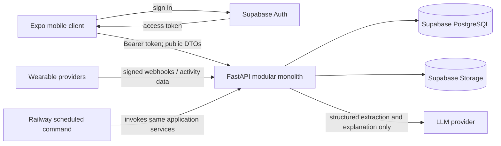
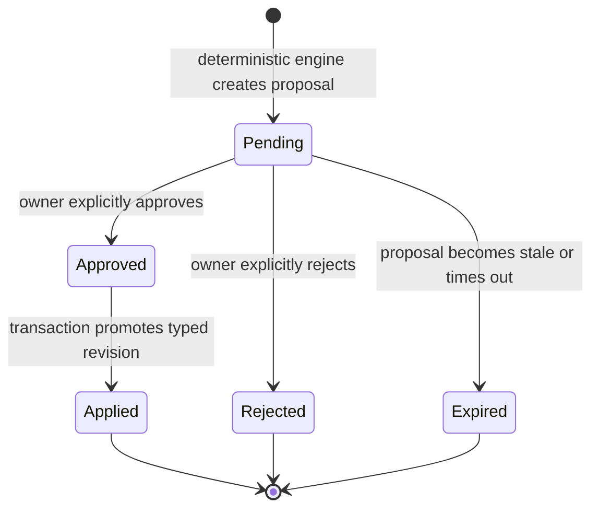

# Start23 Backend Architecture

## Status

This document defines the backend architecture for Start23. The FastAPI
foundation, health/readiness, structured errors, logging, Supabase token
verification, and the Phase 3 deterministic physiology calculation layer are
implemented. Domain persistence and application orchestration remain proposed;
BR-009 clinical validation remains fail-closed.

- Architecture style: modular monolith
- Application framework: Python with FastAPI
- Database, authentication, and object storage: hosted Supabase
- Deployment target: Railway
- Mobile client: React Native with Expo and TypeScript

Related documents:

- [Domain model](domain-model.md)
- [API contracts](api-contracts.md)
- [Security model](security-model.md)
- [MVP roadmap](../implementation/mvp-roadmap.md)
- [Business-rule traceability](../requirements/business-rule-traceability.md)

## Architectural principles

1. All backend modules are deployed as one FastAPI application.
2. Physiological decisions are deterministic Python functions with automated
   tests.
3. FastAPI owns all critical business logic. PostgreSQL constraints protect
   invariants but do not replace domain logic.
4. The LLM may extract structured context and explain deterministic outcomes.
   It may not calculate physiological decisions, directly update training
   zones, or directly change an active plan.
5. System-generated changes to critical objects are stored as pending
   proposals. A user-owned approval action is required before they become
   active.
6. Planned and realized TSS are internal data. They are never included in
   client-facing response models, errors, notifications, exports, or LLM
   messages.
7. Route handlers remain thin. Application services orchestrate use cases,
   domain modules make decisions, and repositories perform persistence.
8. Integration-specific formats are translated into canonical domain inputs at
   the system boundary.
9. The initial architecture must not use microservices, Redis, Celery,
   TimescaleDB, or Kubernetes.

## System context



The Expo client may communicate directly with Supabase Auth. Domain data and
critical mutations flow through FastAPI. Raw activity files may be uploaded to
private Supabase Storage through an authenticated or short-lived signed upload
flow controlled by the backend.

## Proposed source layout

```text
backend/
├── pyproject.toml
├── app/
│   ├── main.py
│   ├── api/
│   │   ├── dependencies.py
│   │   └── router.py
│   ├── core/
│   │   ├── config.py
│   │   ├── errors.py
│   │   ├── logging.py
│   │   └── security.py
│   ├── db/
│   │   ├── base.py
│   │   ├── rls_context.py
│   │   └── session.py
│   ├── modules/
│   │   ├── profiles/
│   │   ├── onboarding/
│   │   ├── goals/
│   │   ├── zones/
│   │   ├── workouts/
│   │   ├── physiology/
│   │   ├── planning/
│   │   ├── activities/
│   │   ├── checkins/
│   │   ├── proposals/
│   │   ├── integrations/
│   │   └── coach/
│   └── jobs/
│       ├── weekly_planning.py
│       └── zone_evaluation.py
└── tests/
    ├── unit/
    ├── integration/
    └── contract/
```

This structure is intentionally proposed rather than created by the
documentation phase.

## Module responsibilities

### Profiles

Owns athlete profile information, biometrics, timezone, motivation, and profile
validation. Supabase Auth remains the source of identity.

### Onboarding

Coordinates resumable onboarding, training history, goal creation, initial zone
configuration, and readiness to create the first plan. It delegates
physiological calculations to `physiology`.

### Goals

Owns SMART goals, race events, A/B/C priority, macrocycles, mesocycles, and race
taper context. Non-race goal behavior remains an unresolved design area.

### Zones

Owns discipline-specific zone profiles, validation sources, fallback state,
test-required state, versioning, and pending zone revisions.

### Workouts

Owns the workout template catalog, segments, expected RPE, phase tags,
discipline, intensity bucket, and server-internal planned TSS.

### Physiology

Contains framework-independent deterministic Python rules:

- training-load progression;
- volume and intensity debt;
- time-based intensity distribution;
- anti-stack validation;
- recovery-week calculation;
- taper calculation;
- activity-load calculation;
- RPE/load match classification;
- injury redistribution;
- progress and zone-evaluation calculations.

This module must not import FastAPI, database sessions, provider SDKs, or LLM
clients.

### Planning

Builds workout decks, constructs plan revisions, schedules workouts, validates
plans, records warnings, and requests approval through `proposals`. It does not
apply an unapproved system-generated revision to an active plan.

### Activities

Owns canonical activity records, planned-workout matching, RPE, telemetry
summaries, internal realized TSS, and match-matrix status.

### Check-ins

Owns weekly check-ins, structured athlete context, availability, injuries,
fatigue, and confirmation of LLM-extracted context.

### Proposals

Owns the approval state machine for critical changes. It applies an approved
typed revision atomically and rejects stale proposals whose base revision is no
longer current.

### Integrations

Contains adapters for wearable providers, FIT/TCX parsing, OAuth token handling,
webhook verification, idempotency, and private Storage operations.

### Coach

Calls the LLM with schema-constrained tasks. It receives sanitized,
deterministically generated conclusions and cannot call an apply/update
operation for a plan or zone.

## Layering and dependency rules

The normal request dependency direction is:

```text
FastAPI router
  -> application service
    -> domain functions and policies
    -> repository interfaces
      -> PostgreSQL / Supabase adapters
```

Rules:

- A router validates transport input and maps exceptions to HTTP responses.
- A service establishes the use-case transaction and coordinates modules.
- A domain function receives explicit values and returns a result without I/O.
- A repository contains persistence queries but no physiological decisions.
- Provider adapters map external data into canonical activity input.
- Cross-module access goes through public service or domain interfaces, not
  another module's repository internals.
- In-process function calls are preferred over queues or distributed events.

## Critical change workflow



An approval transaction must:

1. authenticate the owner;
2. lock or otherwise protect the proposal and target revision;
3. confirm that the proposal is still pending;
4. confirm that its base revision is still current;
5. promote the typed plan or zone revision;
6. mark the proposal applied;
7. write an audit record;
8. commit all state changes together.

Direct user actions, such as manually moving a workout, require a separately
defined policy. The current requirements suggest that an explicit user action
may be applied while returning a warning, but the final boundary between a
direct action and approval of a generated proposal is unresolved.

## Scheduled processing

The modular monolith may expose command entrypoints that use the same
application services as the API. Railway can schedule those commands for
weekly-plan or recovery-week evaluation.

Scheduled processing must be:

- idempotent;
- safe to retry;
- scoped by athlete timezone where relevant;
- guarded against duplicate active plans;
- unable to bypass the pending-proposal requirement;
- auditable by rule-set and input version.

No Celery worker or Redis queue is required. During early MVP phases, explicit
user-triggered generation may replace automatic schedules.

## TSS privacy boundary

TSS is required for internal calculations but prohibited from all mobile-facing
contracts.

Required controls:

- store TSS in server-only columns or a non-exposed database schema;
- use distinct internal and public Pydantic models;
- never serialize ORM objects directly;
- do not include TSS in warnings, error details, logs returned to clients, push
  notifications, exports, or chat messages;
- send the coach qualitative facts such as `volume_above_target`, not raw TSS;
- add API contract tests that recursively inspect response payloads for
  forbidden field names and aliases;
- review observability tooling so payload capture cannot unintentionally expose
  physiological data.

## Error handling and concurrency

Use a consistent application error model with stable codes. Expected categories
include validation errors, authentication failures, ownership failures,
conflicts, stale proposals, provider errors, and temporary processing errors.

Critical updates require revision numbers or equivalent optimistic concurrency.
For example, approval should return a conflict if the user has manually edited
the weekly plan since the proposal was produced.

## Testing strategy

### Unit tests

- Every physiological formula and threshold.
- Boundary values and exact equality behavior.
- Rule-precedence cases.
- Plan and proposal state transitions.
- Discipline-specific zone validation.

### Integration tests

- Authenticated ownership and RLS.
- Proposal application transactions.
- Activity import idempotency.
- Plan/version concurrency.
- Private Storage access.

### API contract tests

- Pydantic response shapes.
- Absence of planned and realized TSS.
- User identity always derived from the verified token.
- Stable error codes.
- No unapproved critical mutation.

### Provider contract tests

- Stored provider fixtures mapped into canonical activity inputs.
- Duplicate and out-of-order webhook handling.
- Invalid signature rejection.

## Deployment model

One deployable backend artifact runs on Railway and connects to hosted
Supabase. Environment-specific configuration is supplied through Railway
secrets. The same artifact may expose an API process and scheduled command
entrypoints, but remains one codebase, one domain model, and one database.

## Unresolved architecture decisions

- Physiological formula details within the locked injury, taper, recovery,
  debt, progression, intensity, anti-stack, and availability precedence.
- Athlete-timezone versus UTC ownership of scheduled plan generation.
- Which wearable provider is supported first.

Resolved decisions:

- authenticated database access uses the Supabase Data API with the caller
  token so RLS retains `auth.uid()` context;
- atomic athlete operations use narrowly granted `SECURITY INVOKER` RPCs;
- direct athlete calendar moves apply with qualitative soft warnings;
- Phase 7 begins with a limited canonical activity-summary input;
- the mobile client upgrades to Expo SDK 57 before mobile implementation.
