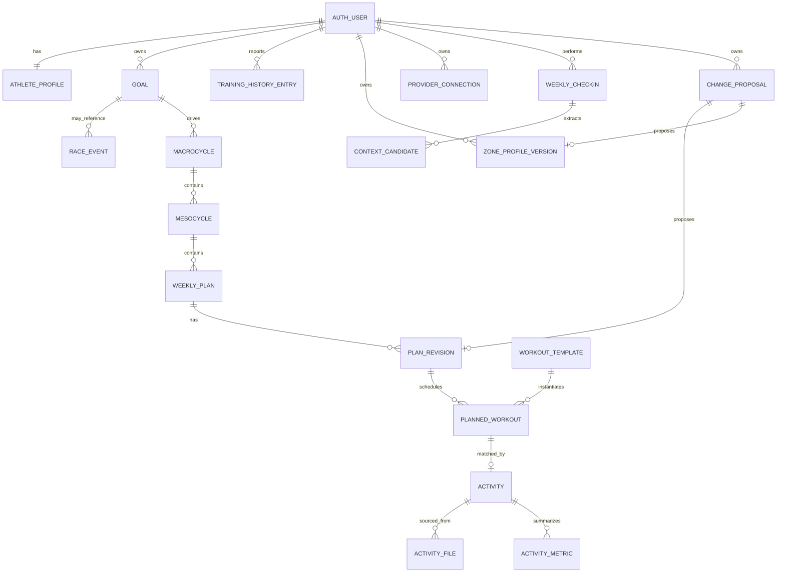

# Start23 Domain Model

## Status

This document defines the logical domain model for Start23. Phase 2 implements
the base athlete profile. The hosted Phase 4 base and hardening migrations
implement profile biometrics, onboarding sessions, triathlon history, the
primary A-race goal, versioned zones, zone proposals, and fingerprinted initial
planning requests. The hosted Phase 5 migration implements the immutable
workout catalog and private template load records. The local, not-yet-applied
Phase 6 migration implements weekly plans, immutable plan revisions, planned-
workout snapshots, qualitative warnings, typed plan proposals, and private
workout/revision load records. The local Phase 7 and Phase 8 migrations add
canonical activities/private realized load and the structured weekly context,
restriction, outside-activity, maintenance, rest-day, and RPE-audit entities
described below. These local migrations are not yet applied to hosted
Supabase; later entities remain subject to their phase-specific design.
The local Phase 8.5 migration adds explicit discipline setup choices,
activity-linked immutable calibration observations, and immutable generated
evaluations. It is not yet applied to hosted Supabase.
The local Phase 11 migration adds discipline test assignments and extends
typed proposals with standalone validation-test targets; it is also unapplied.
Phase 12 adds no entity or migration: its current capability catalog fails
closed before persistence while non-race rules remain unapproved.

Related documents:

- [Backend architecture](backend-architecture.md)
- [API contracts](api-contracts.md)
- [Security model](security-model.md)
- [Business-rule traceability](../requirements/business-rule-traceability.md)

## Modelling principles

- Supabase Auth is the identity authority.
- Every user-owned entity carries an immutable `athlete_id` derived from the
  authenticated user.
- Critical objects are versioned so proposed changes can remain pending.
- TSS and provider credentials are server-only.
- Store canonical units and define conversion at input/output boundaries.
- State machines use constrained values and explicit transitions.
- Calculation and proposal records retain rule-set/version metadata for audit.
- Raw telemetry files are stored in private Supabase Storage; PostgreSQL stores
  metadata and useful summaries.

## Aggregate overview

## Identity and onboarding

### `auth.users`

Managed by Supabase Auth. The UUID authenticates the account but is mapped to a
separate opaque athlete identifier for current domain ownership.

### Split athlete profiles

Current identifying fields live in `athlete_identifying_profiles` and current
physiological fields live in `athlete_physiology_profiles`, both owned by the
opaque athlete identifier. `athlete_profiles` is a bounded legacy compatibility
store for operational timezone, monitor confirmation, onboarding status,
revision, and timestamps. It has no direct authenticated Data API read/write
grant; owner-derived narrow RPCs expose only the operational fields and own
their confirmation timestamps.

Legacy height, weight, motivation, and other retired values remain preserved in
the compatibility row but are not returned by current APIs or reinterpreted.
The MVP stores no new sex/gender/physiology-category field and does not estimate
FTP from a binary coefficient.

### `onboarding_sessions`

Allows onboarding to be resumed and records which steps have been confirmed.
It must not be treated as an active physiological configuration until
completion.

### `initial_plan_requests`

Queues Phase 6 plan generation after onboarding. Every pending request stores a
canonical JSON snapshot of the confirmed profile, training history, primary
goal, and active zone versions plus an MD5 content fingerprint used as the
input revision. Database triggers refresh the snapshot while the request is
pending whenever one of those inputs changes. Consuming or cancelling the
request preserves the captured snapshot and fingerprint for audit and
idempotency.

### `training_history_entries`

One row per athlete and activity category.

Proposed categories:

- swim;
- bike;
- run;
- other endurance;
- other sport.

Proposed fields include weekly minutes, source, confirmation timestamp, and
onboarding session. Whether non-triathlon categories influence phase-one load
is unresolved.

## Goals and periodization

### `goals`

The current MVP goal is one structured active A-race with race name, future
date, total target time, optional discipline target times and focus, plus the
discipline distances applicable to exactly one of five shapes: run, bike, swim,
duathlon, or triathlon. Historical generic goals remain stored separately and
are not treated as current completion evidence.

The required zone mapping is run to run, bike to bike, swim to swim, duathlon to
bike plus run, and triathlon to swim plus bike plus run. Training-history input
is intentionally different: current onboarding still requires separate
previous-month entries for all three disciplines.

The A/B/C terminology is distinct from zone configuration paths A/B/C. API
enums should use unambiguous names such as `goal_priority` and
`zone_setup_method`.

### `race_events`

Represents an event date, discipline profile, and race priority. A race event
may support taper calculation. Non-race goals must not be forced into a race
entity.

Phase 12 therefore keeps the persisted MVP goal as race-only. Its capability
model separately identifies `race_event` and `personal_goal`; general fitness,
weight loss, and muscle gain are visible but unavailable, use a future
cycle-week-1 anchor, and have no persistence path until reviewed rules exist.

### `macrocycles`

Defines a goal-specific training horizon and records the ruleset used to
construct it.

### `mesocycles`

Ordered blocks within a macrocycle. Proposed fields include sequence number,
start/end date, phase, and the planned recovery-week position.

How partial blocks are aligned when working backward from a race is unresolved.

## Zones

### `zone_profile_versions`

Represents a complete version of the athlete's configuration for one
discipline.

Proposed fields:

- `id`, `athlete_id`, `discipline`;
- `version`;
- setup method: `manual`, `test`, or `fallback`;
- lifecycle status: `pending`, `active`, `superseded`, or `rejected`;
- provenance source, including distinct `reviewed_field_threshold` and
  `submaximal_calibration_estimate` values for current calculated profiles;
- validation state: `unreviewed`, `confirmed_by_athlete`, or
  `protocol_validated`;
- `fallback_active`;
- `needs_testing`;
- `needs_validation_test`;
- `effective_from`;
- proposal and calculation references.

At most one active zone profile may exist per athlete and discipline.

### `zone_metrics`

Typed metrics associated with a zone profile version.

Examples:

- swim CSS in seconds per 100 metres;
- cycling FTP in watts;
- cycling threshold heart rate in BPM;
- running threshold pace in seconds per kilometre;
- running LTHR in BPM;
- heart-rate zone lower/upper boundaries.

Ruleset 3 fixes the canonical units and whole-second pace precision. Exact
Cycling speed is not a zone metric. Average/maximum speed may be retained as
bike activity telemetry; it does not drive zone validation or planning.

### `discipline_zone_setups`

Stores exactly one resumable setup choice per athlete and discipline. Current
discovery permits known values and calibration for run/bike, and additionally
the reviewed CSS field test for swim. Historical `rpe_only` and suppressed
run/bike field-test rows remain readable but are not selectable. The row is
configuration intent, never readiness; only an active race-required zone
profile satisfies onboarding.

### `calibration_observations`

Stores one immutable owner-scoped observation per activity, protocol, and
segment. It references the canonical activity and optionally a planned workout,
retains canonical RPE 1-10 plus approved objective summary fields, and rejects
changed retries while returning an identical retry idempotently.

### `calibration_evaluations`

Stores immutable outputs generated by deterministic Python and persisted only
through a narrow service operation. Current submaximal run/bike/swim protocols
produce attributable `threshold_estimated` results and calculated Zone 1-5
profiles under `phase-13-joren-ruleset-1`; these remain pending athlete
confirmation. Historical provisional/RPE-only results retain their original
meaning and are not active zone versions.

### `discipline_test_assignments`

Stores one owner-scoped, date-only reviewed field-test assignment. Its mode is
`standalone` or `weekly_plan`; state is pending, scheduled, completed, rejected,
or cancelled. Standalone assignments are targeted by a `validation_test`
proposal. Integrated assignments reference the exact pending plan revision and
plan proposal, and follow that proposal's decision. A partial unique index
prevents multiple open tests for the same athlete and discipline.

Run and bike protocols with complete duration contracts may be integrated.
The distance-only swim CSS protocol has no approved planned duration/private
load and is therefore standalone-only. Test completion produces protocol
observations and, where the reviewed field-test rules permit, a pending
threshold; it never directly changes `zone_profile_versions`.

### RPE-guided workout targets

`RpeTarget` is a planned-snapshot target for a discipline without an active
profile. It contains a reviewed expected RPE range, deterministic low/high
bucket, and the requirement to collect average heart rate in bpm after
completion. It is mutually exclusive with a numeric zone target and with a
protocol target. The catalog's zone version remains immutable; only the owned
planned snapshot is projected. An RPE/heart-rate observation alone cannot
manufacture a zone.

## Athlete context

### `injury_restrictions`

Represents athlete-reported injury context by discipline.

Implemented Phase 8 fields:

- `athlete_id`, `discipline`;
- functional restriction status and allowed intensity;
- reported source;
- start and mandatory seven-day review timestamps;
- confirmation timestamp;
- optional attributable professional advice and its timestamp;
- explicit athlete plan choice (`keep_blocked`, `train_low_only`, or
  `resume_unrestricted`);
- cleared timestamp.

Start23 uses functional restriction status and allowed intensity, not diagnosis
or severity. The locked Phase 8 model is documented in the Phase 0-7 decision
register. A restriction is reviewed after seven days and never silently
cleared; automatic load redistribution is disabled.

### Check-in availability

Phase 8 snapshots blocked local dates inside a revisioned
`weekly_checkin_contexts.payload`. It deterministically derives availability
only for the requested athlete-local Monday-Sunday week. Strenuous planned
outside activities remove their local date from generated availability. Plan
revisions retain the exact derived date snapshot. Phase 10 uses
`available_dates date[]` and records provenance as `explicit`,
`previous_week`, or `checkin`. Previous-week dates are shifted into the new
week only after an explicit athlete request; absence never implies reuse.

### Temporary athlete state

Confirmed check-in context stores fatigue, missed-workout reasons, blocked
dates, outside sport, and restrictions. Every version records source
`structured_form`, a fingerprint, and expiry at the end of its local week so
temporary context does not persist indefinitely.

## Workout catalog

### `workout_templates`

Immutable versioned catalog item. A stable `template_key` groups versions and
the highest version is current; published versions are never updated in place.

Proposed fields:

- discipline;
- name and instructions;
- duration and optional distance;
- intensity bucket;
- expected RPE minimum and maximum;
- training phase tags;
- required zone metrics;
- fallback compatibility;
- stable template key and positive version;
- server-internal precomputed planned TSS.

The public template structure is stored separately from
`private.workout_template_loads`. Authenticated athlete roles have read-only
access to the public tables and no access to the private schema. Public workout
representations omit the planned TSS field. A service-role-only RPC returns the
complete durable representation to the restricted backend planning repository;
the service role has no direct private-table access.

### `workout_segments`

Ordered workout instructions with positive duration, optional distance, zone
target, expected RPE, and technique metadata. Segment durations and distances
must reconcile to their immutable template version.

### `workout_tags`

Phase 5 implements normalized training-phase and zone-requirement tags plus an
explicit fallback-compatibility value. Broader goal, equipment, test, and
injury tags remain later catalog extensions.

## Plans and schedules

### `weekly_plans`

Stable identity for an athlete and ISO-like training week.

Proposed fields:

- `id`, `athlete_id`, `week_start`;
- active revision;
- lifecycle state;
- user timezone;
- timestamps.

A unique constraint prevents multiple stable weekly plans for the same athlete
and week. The active revision is a deferred composite foreign key.

### `plan_revisions`

Versioned content of a weekly plan. Phase, target basis, optional taper period,
input/generation fingerprints, check-in identity, confirmed blocked and
low-only disciplines, available athlete-local dates, and availability
provenance are snapshotted with the revision.
Hidden target and planned load are stored in `private.plan_revision_loads`.

Proposed states:

- `draft`;
- `pending_approval`;
- `active`;
- `rejected`;
- `superseded`;
- `expired`.

Every generated critical change produces a new revision. Approval promotes the
revision rather than overwriting the active one in place.

### `planned_workouts`

Belongs to a plan revision and references a versioned workout template.

Proposed fields:

- authoritative athlete-local `scheduled_date`;
- discipline and presentation snapshot;
- expected duration, distance, zones, and RPE;
- status;
- source: athlete-selected, auto-planned, imported, or system-adjusted;
- server-internal planned TSS snapshot.

The snapshot protects historical plans from later catalog edits. Hidden load
is stored separately in `private.planned_workout_loads`; public planned-workout
rows contain no TSS column. A legacy internal timestamp may be retained as an
athlete-local-noon compatibility projection for existing private relations; it
is neither a prescribed training time nor exposed by a planning/calendar DTO.

### `plan_warnings`

Records rule validation results such as:

- volume overshoot;
- intensity-ratio deviation;
- anti-stack violation;
- injury conflict;
- unavailable-day conflict;
- stale zones.

Warnings include a BR code, severity, affected object, and public qualitative
message. They do not include TSS.

## Activity execution

### `activities`

Canonical completed activity. Phase 7 persists:

- `id`, `athlete_id`;
- optional `planned_workout_id`; a Phase 8 planned outside activity links to
  its canonical completion from `planned_external_activities`;
- canonical source and athlete-scoped idempotency key/fingerprint;
- discipline;
- start time and timezone;
- duration, distance, and elevation;
- RPE and RPE submission time;
- match status;
- processing state;
- qualitative result/message and an optional pending-correction reference.

An activity may be unmatched. In Phase 7, matching is only an explicit owned,
active `planned_workout_id`; discipline must agree and one planned workout can
be matched only once. Automatic time-proximity, brick, and multisport matching
are deferred. Canonical request fingerprinting prevents duplicate creation.

Server-internal realized load is stored separately in
`private.activity_loads`, with no direct Data API grant. The method named
`actual_rpe_times_duration_hours` and its Python helper are explicitly legacy
Phase 7 behavior only. Current Phase 13 uses observed zone minutes or the
full-duration average-HR-zone estimate with its originating profile and
ruleset provenance. RPE corrections remain athlete-local-week bounded and
stale-safe; an average-HR change is rejected once a Phase 13 load exists so
public evidence and private provenance cannot diverge.

### `activity_metrics`

Stores optional safe summaries such as average/max heart rate, normalized
power, average pace, and low/high intensity minutes. Raw samples and interval
telemetry are not accepted by the Phase 7 canonical-summary contract.

### `activity_files`

Stores private Storage bucket/path, content type, checksum, parser version, and
retention metadata for FIT/TCX or related files.

Phase 9 implements bucket/path, content type, byte size, and SHA-256 metadata
for available Polar FIT files. Parser version and retention metadata remain
pending because the MVP imports the provider's validated summary through
UC-03 and stores the raw file without parsing it.

Per-sample telemetry should remain in compressed private objects unless a
defined query requires normalized PostgreSQL storage. TimescaleDB is explicitly
out of scope.

## Integrations

### `provider_connections`

One connection per athlete/provider. Phase 9 currently permits only the
provisional `polar` provider.

The public owner-scoped record contains provider identity, status, and
connection/import timestamps. Access tokens are held separately in
`private.provider_tokens`, with no Data API table grant, and never enter client
models.

### `webhook_receipts`

Private records retain a SHA-256 event key and payload fingerprint, minimal
provider event identifiers, receipt/processing state, and sanitized failure
code. A provider/event-key uniqueness constraint supplies idempotency after
FastAPI verifies Polar's HMAC and timestamp.

### `import_runs`

Owner-readable records track historical/webhook attempts, the bounded date
window, safe counts, sanitized failure code, and completion state. Private
`provider_activity_imports` maps a provider exercise ID to the canonical
activity and prevents duplicate imports.

## Check-ins and coach

### `weekly_checkins`

One idempotent check-in per athlete/local Monday week, with athlete timezone,
current context revision, lifecycle state, and eventual pending plan proposal.

### `weekly_checkin_contexts`

Immutable revisioned structured-form context. A draft is superseded on edit;
the exact fingerprint must be explicitly confirmed before it can affect a
pending plan. Confirmed versions persist source and expiry.

### `planned_external_activities`

An outside sport confirmed during check-in, with planned local time, duration,
discipline, strenuous/recurring flags, and an optional later canonical
activity completion. Actual duration and RPE live only on that activity.

### `goal_maintenance_states`

An explicit achieved-goal state. While active, deterministic planning holds
load on build weeks, retains the four-build/one-recovery rhythm, and never
applies normal progression.

### `context_candidates`

No Phase 10 row is persisted. The constrained coach returns an ephemeral,
schema-validated candidate containing only bounded dates/enums/text. The
athlete may explicitly copy non-critical fields into the structured form;
possible injury disciplines remain informational and require a manual
restriction choice. Only the separately saved and confirmed
`weekly_checkin_contexts` revision can affect deterministic planning. Durable
candidate storage remains unavailable until privacy/retention approval.

### `coach_messages`

Stores conversation messages only if retention and consent are approved.
Messages must not expose TSS. Sensitive-data minimization and deletion policy
remain open requirements.

## Proposals and audit

### `change_proposals`

Envelope for a critical pending change.

Proposed fields:

- `id`, `athlete_id`;
- kind: plan revision, zone revision, or validation-test scheduling;
- typed target revision reference;
- base revision;
- state: pending, approved, rejected, expired, applied;
- deterministic reason codes;
- public explanation;
- created, decided, and applied timestamps;
- decision actor;
- ruleset version.

Generic arbitrary mutation JSON should not be executable. A proposal points to a
typed, already validated revision.

### `decision_runs`

Audit record for deterministic evaluation:

- rule-set/version;
- calculation name;
- input snapshot hash;
- non-secret result summary;
- warning and proposal references;
- timestamps.

Whether full inputs can be retained depends on health-data retention policy.

## Internal versus public data

Internal-only examples:

- planned TSS;
- realized TSS;
- physiological debt values;
- raw provider tokens;
- raw telemetry and GPS files;
- rule-engine input snapshots containing hidden values.

Public examples:

- workout duration and distance;
- target zones and RPE;
- intensity distribution percentages based on time;
- qualitative warnings;
- proposal rationale;
- plan and activity status.

Public database views are not a substitute for explicit API response models. If
views are introduced, they must obey RLS and omit hidden fields.

## Open domain decisions

- Concrete versioned BR-009 soft-range records and a complete reviewed Zone
  1-5 model. Phase 8.5 now has official Start23 field-test and submaximal
  calibration protocols, but their threshold formulas do not define percentage
  bands or all pace-rounding rules; calculated boundaries remain fail-closed.
- Automatic activity-to-plan matching rules, including proximity, bricks, and
  multisport activities.
- Reviewed non-race macrocycles, maintenance entry/exit rules, goal-specific
  time-based intensity ratios, progression/recovery rules, and workout-catalog
  eligibility. Phase 12 exposes these goal families only as unavailable until
  that complete versioned ruleset exists.
- Retention, deletion, export, and consent requirements for health and GPS data.
- Production approval of provisional Polar AccessLink processing and its
  retention/brand obligations.

Resolved for MVP:

- weekly-plan, proposal, activity, and zone state machines are defined in the
  Phase 0 decision lock;
- orchestration precedence is injury, taper, recovery, debt, progression,
  intensity/anti-stack, then availability;
- validation-test approval never authorizes a later zone update.
- Phase 7 matching is explicit planned-workout selection or unmatched; one
  planned workout can be matched once and the discipline must agree.
- Phase 8 allows auditable RPE correction only during the activity's current
  athlete-local week; identical values remain idempotent and later weeks are
  immutable.
- Exact mixed-workout ties classify as high intensity while exact segment
  minutes remain available for BR-003 arithmetic.
- Athlete UI uses complementary half-up whole percentages plus exact minutes.
- Shared zone boundaries belong to the physiologically more intense zone.
- Cycling speed is bike activity telemetry only, never a zone/planning metric.
- The MVP collects no sex/gender/physiology category and performs no binary FTP
  estimate.
- Functional injury restrictions replace medical severity, and automatic
  injury-load redistribution is disabled.
- canonical zone units are CSS seconds/100 m, FTP watts, threshold heart rate
  BPM, run threshold pace seconds/km, and run LTHR BPM;
- `phase-3-ruleset-1` approves calculation policy for BR-002, BR-003, BR-004,
  BR-006, BR-007, BR-008, and BR-010.
- `phase-3-ruleset-2` historically added BR-009 soft-range review, input
  conversion, contiguous boundaries, and unreviewed Karvonen fallback.
- `phase-3-ruleset-3` records the accepted Phase 0-7 decisions; qualified
  production approval of the active rules and `start23-zone-model-1.0` was
  confirmed complete on 2026-08-24. Changed rules require a new review.
- `phase-10-ruleset-1` preserves the 72 elapsed-hour run rule and changes only
  the 48-hour bike/swim rule to require two complete intervening athlete-local
  rest dates. This material amendment reopens physiological production review.
