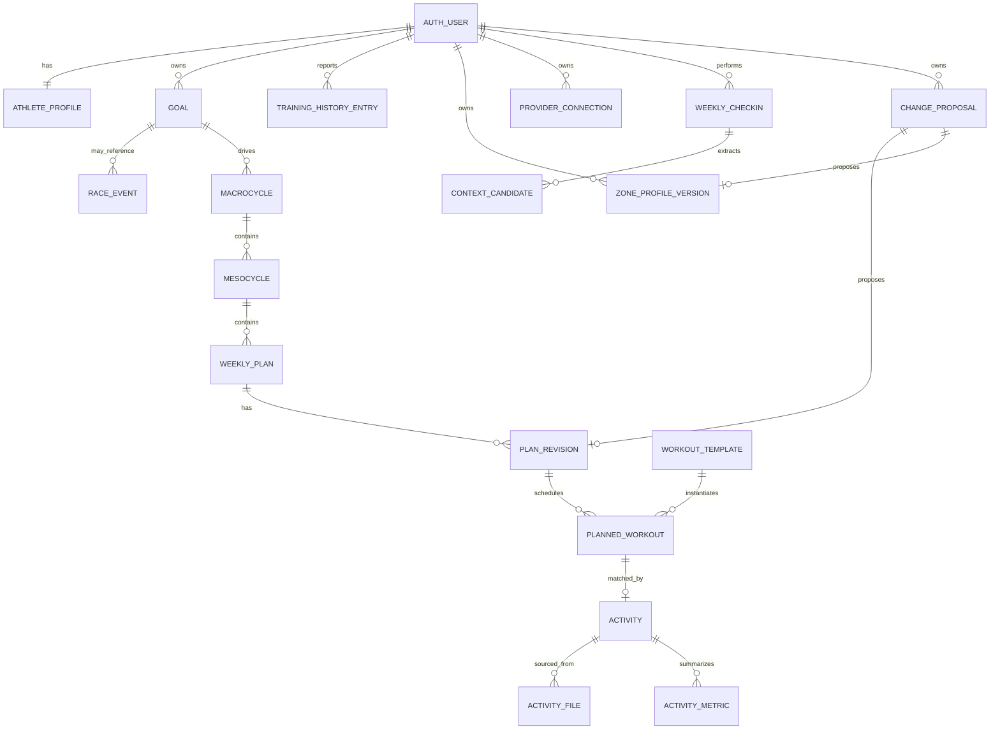

# Start23 Domain Model

## Status

This document proposes the logical domain model for Start23. Entity names,
columns, and state machines are subject to migration design and resolution of
the open requirements. No database schema has been implemented.

Related documents:

- [Backend architecture](backend-architecture.md)
- [API contracts](api-contracts.md)
- [Security model](security-model.md)
- [Business-rule traceability](../requirements/business-rule-traceability.md)

## Modelling principles

- Supabase Auth is the identity authority.
- Every user-owned entity carries an immutable `athlete_id` derived from the
  authenticated user.
- Critical objects are versioned so proposed changes can remain pending.
- TSS and provider credentials are server-only.
- Store canonical units and define conversion at input/output boundaries.
- State machines use constrained values and explicit transitions.
- Calculation and proposal records retain rule-set/version metadata for audit.
- Raw telemetry files are stored in private Supabase Storage; PostgreSQL stores
  metadata and useful summaries.

## Aggregate overview

## Identity and onboarding

### `auth.users`

Managed by Supabase Auth. Its UUID is the canonical athlete identity.

### `athlete_profiles`

One-to-one with `auth.users`.

Proposed fields:

- `athlete_id`;
- `date_of_birth` or a documented alternative;
- `sex_or_physiology_input`, subject to product and clinical review;
- `height_cm`;
- `weight_kg`;
- `resting_heart_rate_bpm`;
- `motivation_text`;
- `motivation_tag`;
- `timezone`;
- `onboarding_status`;
- timestamps and revision.

Open question: the source requirements ask for age and binary sex inputs. The
storage and validation policy must be resolved before implementation.

### `onboarding_sessions`

Allows onboarding to be resumed and records which steps have been confirmed.
It must not be treated as an active physiological configuration until
completion.

### `training_history_entries`

One row per athlete and activity category.

Proposed categories:

- swim;
- bike;
- run;
- other endurance;
- other sport.

Proposed fields include weekly minutes, source, confirmation timestamp, and
onboarding session. Whether non-triathlon categories influence phase-one load
is unresolved.

## Goals and periodization

### `goals`

Represents a SMART objective.

Proposed fields:

- `id`, `athlete_id`;
- priority `A`, `B`, or `C`;
- goal type;
- specific description;
- measurable metric type, value, and unit;
- feasibility score from 1 through 10;
- target date;
- status;
- optional race-event reference.

The A/B/C terminology is distinct from zone configuration paths A/B/C. API
enums should use unambiguous names such as `goal_priority` and
`zone_setup_method`.

### `race_events`

Represents an event date, discipline profile, and race priority. A race event
may support taper calculation. Non-race goals must not be forced into a race
entity.

### `macrocycles`

Defines a goal-specific training horizon and records the ruleset used to
construct it.

### `mesocycles`

Ordered blocks within a macrocycle. Proposed fields include sequence number,
start/end date, phase, and the planned recovery-week position.

How partial blocks are aligned when working backward from a race is unresolved.

## Zones

### `zone_profile_versions`

Represents a complete version of the athlete's configuration for one
discipline.

Proposed fields:

- `id`, `athlete_id`, `discipline`;
- `version`;
- setup method: `manual`, `test`, or `fallback`;
- lifecycle status: `pending`, `active`, `superseded`, or `rejected`;
- `validated`;
- `fallback_active`;
- `needs_testing`;
- `needs_validation_test`;
- `effective_from`;
- proposal and calculation references.

At most one active zone profile may exist per athlete and discipline.

### `zone_metrics`

Typed metrics associated with a zone profile version.

Examples:

- swim CSS in seconds per 100 metres;
- cycling FTP in watts;
- cycling threshold heart rate in BPM;
- running threshold pace in seconds per kilometre;
- running LTHR in BPM;
- heart-rate zone lower/upper boundaries.

Canonical units and precision must be specified before migrations.

## Athlete context

### `injuries`

Represents athlete-reported injury context by discipline.

Proposed fields:

- `athlete_id`, `discipline`;
- state and severity;
- reported source;
- start date and optional end date;
- confirmation timestamp;
- optional notes;
- cleared timestamp.

The clinical meaning of severity, clearance, and whether any load may be
redistributed remains unresolved.

### `availability_blocks`

Represents dates or time windows on which the athlete cannot train. Timezone is
required for correct calendar behavior.

### `athlete_state`

Stores current confirmed context flags such as fatigue warning or agenda
stress. A source and expiry are required so temporary context does not persist
indefinitely.

## Workout catalog

### `workout_templates`

Immutable or versioned catalog item.

Proposed fields:

- discipline;
- name and instructions;
- duration and optional distance;
- intensity bucket;
- expected RPE minimum and maximum;
- training phase tags;
- required zone metrics;
- fallback compatibility;
- active catalog version;
- server-internal precomputed planned TSS.

Public workout representations omit the planned TSS field.

### `workout_segments`

Ordered workout instructions with duration or distance, zone target, RPE target,
and recovery description.

### `workout_tags`

Supports phase, goal, equipment, test, injury compatibility, and other catalog
filtering without embedding provider or presentation logic in the planner.

## Plans and schedules

### `weekly_plans`

Stable identity for an athlete and ISO-like training week.

Proposed fields:

- `id`, `athlete_id`, `week_start`;
- macrocycle and mesocycle references;
- active revision;
- lifecycle state;
- recovery/taper indicators;
- user timezone;
- server-internal aggregate planned and realized TSS;
- overshoot and warning summaries.

A database constraint should prevent multiple active weekly plans for the same
athlete and week.

### `plan_revisions`

Versioned content of a weekly plan.

Proposed states:

- `draft`;
- `pending_approval`;
- `active`;
- `rejected`;
- `superseded`;
- `expired`.

Every generated critical change produces a new revision. Approval promotes the
revision rather than overwriting the active one in place.

### `planned_workouts`

Belongs to a plan revision and references a versioned workout template.

Proposed fields:

- scheduled start and timezone;
- discipline and presentation snapshot;
- expected duration, distance, zones, and RPE;
- status;
- source: athlete-selected, auto-planned, imported, or system-adjusted;
- server-internal planned TSS snapshot.

The snapshot protects historical plans from later catalog edits.

### `plan_warnings`

Records rule validation results such as:

- volume overshoot;
- intensity-ratio deviation;
- anti-stack violation;
- injury conflict;
- unavailable-day conflict;
- stale zones.

Warnings include a BR code, severity, affected object, and public qualitative
message. They do not include TSS.

## Activity execution

### `activities`

Canonical completed activity.

Proposed fields:

- `id`, `athlete_id`;
- optional `planned_workout_id`;
- provider and provider activity ID;
- discipline;
- start time and timezone;
- duration, distance, and elevation;
- RPE and RPE submission time;
- match status;
- processing state;
- server-internal realized TSS.

An imported activity may be unmatched. Provider uniqueness constraints prevent
duplicate activity creation.

### `activity_metrics`

Stores derived summaries such as average/max heart rate, normalized power,
average pace, interval summaries, data quality, and canonical calculation
inputs.

### `activity_files`

Stores private Storage bucket/path, content type, checksum, parser version, and
retention metadata for FIT/TCX or related files.

Per-sample telemetry should remain in compressed private objects unless a
defined query requires normalized PostgreSQL storage. TimescaleDB is explicitly
out of scope.

## Integrations

### `provider_connections`

One or more provider connections per athlete.

Contains provider identity, scopes, status, and secret-reference metadata.
Refresh/access tokens must be encrypted or kept in a server-side secret store
and must never be exposed through client models.

### `webhook_receipts`

Records provider event identity, signature validation result, receipt time,
processing state, and retry information. A uniqueness constraint supplies
idempotency.

### `import_runs`

Tracks parsing/import attempts, parser version, input checksum, errors, and
resulting activity.

## Check-ins and coach

### `weekly_checkins`

One check-in session for an athlete/week, with status and associated prior/next
weekly plans.

### `context_candidates`

Stores schema-validated context extracted by the LLM or entered through a
structured form. Candidate context is not active until confirmed where it can
cause a critical plan change.

### `coach_messages`

Stores conversation messages only if retention and consent are approved.
Messages must not expose TSS. Sensitive-data minimization and deletion policy
remain open requirements.

## Proposals and audit

### `change_proposals`

Envelope for a critical pending change.

Proposed fields:

- `id`, `athlete_id`;
- kind: plan revision, zone revision, or validation-test scheduling;
- typed target revision reference;
- base revision;
- state: pending, approved, rejected, expired, applied;
- deterministic reason codes;
- public explanation;
- created, decided, and applied timestamps;
- decision actor;
- ruleset version.

Generic arbitrary mutation JSON should not be executable. A proposal points to a
typed, already validated revision.

### `decision_runs`

Audit record for deterministic evaluation:

- rule-set/version;
- calculation name;
- input snapshot hash;
- non-secret result summary;
- warning and proposal references;
- timestamps.

Whether full inputs can be retained depends on health-data retention policy.

## Internal versus public data

Internal-only examples:

- planned TSS;
- realized TSS;
- physiological debt values;
- raw provider tokens;
- raw telemetry and GPS files;
- rule-engine input snapshots containing hidden values.

Public examples:

- workout duration and distance;
- target zones and RPE;
- intensity distribution percentages based on time;
- qualitative warnings;
- proposal rationale;
- plan and activity status.

Public database views are not a substitute for explicit API response models. If
views are introduced, they must obey RLS and omit hidden fields.

## Open domain decisions

- Meaning and duration of `injury_blocked` and `fatigue_warning`.
- BR-009 numeric clinical ranges, zone-boundary equality ownership, accepted
  input conversions, stored precision, and fallback formulas.
- Athlete-facing display precision for exact BR-003 percentages.
- Category ownership for an exact dominant-duration tie in a mixed workout.
- Activity-to-plan matching rules, including bricks and multisport activities.
- Non-race macrocycles and goal-specific intensity ratios.
- Retention, deletion, export, and consent requirements for health and GPS data.

Resolved for MVP:

- weekly-plan, proposal, activity, and zone state machines are defined in the
  Phase 0 decision lock;
- orchestration precedence is injury, taper, recovery, debt, progression,
  intensity/anti-stack, then availability;
- validation-test approval never authorizes a later zone update.
- canonical zone units are CSS seconds/100 m, FTP watts, threshold heart rate
  BPM, run threshold pace seconds/km, and run LTHR BPM;
- `phase-3-ruleset-1` approves calculation policy for BR-002, BR-003, BR-004,
  BR-006, BR-007, BR-008, and BR-010.
