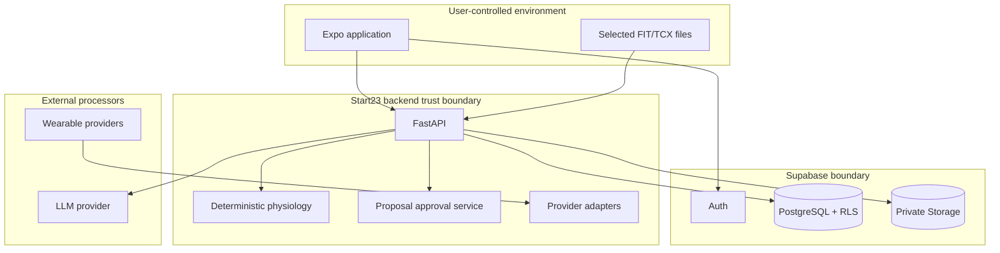

# Start23 Security Model

## Status

This document defines the security boundaries for the Start23 Expo client,
FastAPI backend, Supabase platform, wearable providers, and LLM provider.
FastAPI token verification, token-derived identity, safe authentication
errors, token-redaction conventions, and the Phase 4 base RLS schema are
implemented. The Phase 4 forward hardening and Phase 5 catalog migrations are
applied in hosted Supabase and pass linked schema lint. The local Phase 6
migration adds forced-RLS planning tables and private load snapshots but has
not been applied. The local Phase 8.5 migration adds forced-RLS setup,
observation, and evaluation tables plus bounded RPCs, but it also remains
unapplied. Their pgTAP suites and real-token end-to-end verification remain
pending. Storage controls await their respective migration.

Related documents:

- [Backend architecture](backend-architecture.md)
- [Domain model](domain-model.md)
- [API contracts](api-contracts.md)

## Security objectives

1. An athlete can access only their own data.
2. Critical plan and zone changes cannot be applied without explicit approval.
3. Planned and realized TSS never reach a user-facing surface.
4. Provider credentials, database credentials, service keys, and LLM keys never
   reach the Expo bundle.
5. Health, GPS, injury, and conversation data are minimized and protected.
6. Provider webhooks and imports are authenticated, idempotent, and auditable.
7. LLM output cannot bypass deterministic business rules or mutation controls.
8. Security remains layered even when one application check fails.

## Trust boundaries

The device, all request fields, provider payloads, uploaded files, webhook
events, and LLM output are untrusted input.

## Expo client boundary

The mobile bundle may contain:

- FastAPI base URL;
- Supabase project URL;
- Supabase publishable/anon key;
- public provider identifiers required by a supported OAuth flow.

It must not contain:

- Supabase service-role or secret key;
- PostgreSQL password or connection string;
- wearable provider client secret;
- LLM API key;
- signing keys;
- internal TSS or decision-engine configuration intended to remain private.

Requirements:

- Store refresh/session material using the secure storage approach supported by
  the selected Expo SDK.
- Treat the device as compromised: server authorization cannot depend on hidden
  UI controls.
- Never trust a client-supplied athlete ID.
- Minimize offline persistence of health, injury, GPS, and conversation data.
- Redact tokens and sensitive payloads from mobile logs and crash reports.
- Use deep-link and OAuth redirect validation appropriate to the chosen
  provider.

The mobile client upgrades to Expo SDK 57 before mobile implementation. Access
tokens remain in memory; refresh/session material will use the SDK-compatible
`expo-secure-store` integration after that upgrade.

## Authentication

Supabase Auth is the identity provider. FastAPI accepts a bearer access token
and verifies:

- cryptographic signature using the configured Supabase signing mechanism;
- issuer;
- audience where configured;
- expiry and not-before claims;
- subject;
- accepted role/token type.

FastAPI derives `athlete_id` from the verified `sub` claim. The backend must not
accept a request-body or query-string user ID as an authorization source.

Signing-key rotation and JWKS caching must have bounded cache lifetimes and a
refresh-on-unknown-key path. Shared-secret verification, if the Supabase
project still uses it, requires a separately documented server-side approach.

Reference:
[Supabase JWT documentation](https://supabase.com/docs/guides/auth/jwts).

## Authorization and RLS

Application services enforce resource ownership. PostgreSQL RLS provides
defense in depth for all user-owned rows.

Required policy pattern:

- enable RLS on every user-owned table;
- scope policies to the authenticated role;
- require `auth.uid()` to be non-null;
- compare `auth.uid()` with immutable `athlete_id`;
- use both `USING` and `WITH CHECK` for updates;
- index ownership columns;
- prevent athletes from changing ownership fields;
- test every policy with two distinct users.

Reference:
[Supabase Row Level Security](https://supabase.com/docs/guides/database/postgres/row-level-security).

### Backend database access

The database-access method must preserve:

- atomic multi-table approval transactions;
- athlete ownership context;
- RLS defense in depth;
- narrowly scoped privileges.

A service-role key bypasses RLS and therefore must not become the default
credential for normal athlete requests. If privileged credentials are required
for provider webhooks or scheduled work, those code paths must explicitly scope
every operation to an athlete, have a restricted repository surface, and be
covered by cross-athlete tests.

For normal athlete requests, FastAPI forwards the already-verified user access
token to the Supabase Data API together with the publishable project key.
PostgreSQL therefore evaluates explicit grants and RLS as `authenticated`, and
`auth.uid()` represents the caller. FastAPI also enforces ownership at the
application-service layer.

Atomic critical changes use narrowly granted `SECURITY INVOKER` database
functions invoked with the same user token. They derive ownership from
`auth.uid()` and do not accept an authoritative athlete ID. `SECURITY DEFINER`
and service-role access are excluded from this normal athlete path. Privileged
credentials use separate restricted repositories and cross-athlete tests.

Two narrow privileged paths are now defined. FastAPI uses a server-only
Supabase secret key to persist Python-generated fallback zones through
`save_fallback_zone_profile` and to read the TSS-bearing durable workout
catalog through `get_workout_catalog_for_planning`. Both functions are
`SECURITY DEFINER`, explicitly reject non-`service_role` callers, have
`EXECUTE` revoked from `PUBLIC`, `anon`, and `authenticated`, and expose no
general table mutation surface. The secret key is sent only as the Data API
`apikey`; it is never forwarded to or stored by the Expo client.

The fallback RPC accepts the verified athlete identifier only from this trusted
repository. It forces the estimated fallback method, unreviewed provenance, and
ruleset version before delegating to the same invariant-preserving zone
transaction. Direct athlete-token fallback RPC calls are rejected. Hosted
probes verify anonymous denial and positive server-only execution for both
privileged paths without leaving test rows.

Phase 8.5 adds an owner-token `SECURITY INVOKER` observation path and a separate
service-only `save_calibration_evaluation` RPC. The observation RPC verifies
the referenced canonical activity belongs to `auth.uid()` and recomputes its
stored payload fingerprint. The evaluation RPC rejects public/authenticated
execution and accepts only the bounded deterministic result produced after
FastAPI has verified the athlete token; it cannot activate a zone profile.

Supabase grants and RLS are treated as separate controls. Exposed objects
receive explicit minimum grants because automatic Data API exposure is being
removed from Supabase defaults.

## Physiology production governance

Qualified human review of the active `phase-3-ruleset-3` rules and
`start23-zone-model-1.0` was confirmed complete by the product owner on
2026-08-24. Reviewer identity, evidence, decision, and review-cycle metadata are
retained in the external product-governance record rather than duplicated in
source control. An LLM cannot act as reviewer, approve soft clinical ranges,
or satisfy a new gate. Changed, expired, missing, or rejected approval still
fails closed.

The MVP deliberately omits sex/gender/physiology-category data and makes no
binary-coefficient FTP estimate. Injury data is minimized to functional
restriction, allowed intensity, affected discipline, timing, source, and
review state; Start23 does not infer a diagnosis or clinical severity.

## Critical-object authorization

Critical objects include:

- active zone profiles;
- active weekly-plan revisions;
- system-generated changes to active calendar workouts.

Phase 8 weekly context is sensitive owner data rather than an automatically
active planning mutation. It is stored behind forced RLS and explicit grants;
direct table writes are trigger-blocked, exact structured context must be
fingerprint-confirmed, and only then may the backend create a separate pending
plan revision. Restriction review never silently clears a prior state.

Required controls:

1. The deterministic engine creates a typed pending revision.
2. The proposal is owned by the athlete.
3. Approval is an explicit authenticated operation.
4. Approval identifies a specific proposal and expected base revision.
5. The backend rejects stale or already-decided proposals.
6. Application is atomic and audited.
7. The LLM cannot emit or replay a privileged approval credential.

An affirmative chat message may be translated into an approval only if the UI
binds it unambiguously to one visible proposal and the final product
requirements explicitly permit chat approval.

## TSS confidentiality

Planned and realized TSS are confidential from the athlete-facing product even
though they are not credentials.

Controls:

- store hidden load values outside client-accessible schemas or revoke direct
  client-role access;
- exclude them from public Pydantic models;
- avoid generic serialization;
- forbid them in client errors, notifications, exports, and coach messages;
- prevent indirect disclosure through internal debug fields;
- sanitize server traces captured by third-party observability services;
- add recursive response tests for prohibited field names;
- provide the LLM only qualitative rule outcomes.

Phase 5 stores template planned load in
`private.workout_template_loads`. The `anon`, `authenticated`, and
`service_role` roles receive no table access, while authenticated athletes can
only select the separate public catalog structure. The FastAPI catalog response
is mapped field-by-field into TSS-free Pydantic models. Phase 6 obtains the
durable TSS-bearing representation only through the service-role-only planning
catalog RPC; the service role retains no direct table privilege.

Phase 6 stores plan load snapshots in two additional private tables with no
direct `anon`, `authenticated`, or `service_role` table privilege. Generated
plan persistence and direct-move snapshot copying are service-only RPCs that
explicitly verify the `service_role` claim and accept the athlete identifier
only from the token-verifying FastAPI repository. Plan approval and rejection
are security-invoker RPCs that retain `auth.uid()` ownership context and lock
the proposal, revision, and stable plan before applying a stale-safe decision.

Phase 7 stores realized activity load only in `private.activity_loads`, which
has no direct API-role grant. Canonical create/read/list operations derive the
athlete from `auth.uid()` and expose an explicit TSS-free JSON projection.
FastAPI performs deterministic activity processing and calls only a bounded
service-only completion RPC with the already verified athlete ID. That RPC may
create a typed pending correction revision, but cannot activate it; the normal
owner-scoped proposal approval remains mandatory. Activity API/OpenAPI tests
recursively reject planned and realized TSS aliases.

The final policy should clarify whether staff/admin tools may show TSS. Until
then, no user-facing or general support endpoint should expose it.

## Supabase Storage

Phase 9 uses the private `activity-files` bucket for available Polar FIT files.
Objects use athlete/activity/provider-entity paths, accept only the configured
binary content type up to 25 MiB, and have SHA-256 metadata. Backend writes use
the narrowly held secret key; owner reads remain subject to Storage RLS.

Required controls:

- user-scoped object paths using non-guessable activity identifiers;
- RLS policies on `storage.objects`;
- authenticated or short-lived signed upload/download operations;
- server validation of content type, extension, size, and checksum;
- parser isolation and strict resource limits;
- no public bucket for activity files;
- defined retention and deletion;
- authorization checked independently of object path supplied by the client.

Supabase notes that Storage access is controlled through RLS and that service
keys bypass those controls:
[Storage access control](https://supabase.com/docs/guides/storage/security/access-control).

## Wearable integrations and webhooks

Provider connections require:

- OAuth `state` and PKCE where supported;
- strict redirect URI allowlists;
- encrypted or server-confined refresh tokens;
- minimum scopes;
- token revocation on disconnect;
- signature/challenge verification;
- event-ID and payload-checksum idempotency;
- replay protection where the provider supplies timestamps/nonces;
- retry-safe import state;
- rate-limit and backoff handling without Redis;
- provider payload redaction in logs.

The provisional Polar integration uses one-time OAuth state, the minimum
`accesslink.read_all` scope, server-confined access tokens, provider
deregistration before local token deletion, HMAC-SHA256 verification, a
ten-minute event timestamp window, unique receipt fingerprints, and a bounded
30-day post-registration exercise import. Production processor/legal approval
and real-credential verification remain required.

## LLM boundary

The Phase 8 structured check-in does not invoke an LLM. Its form payload is
strictly validated and separately confirmed. A pulled-forward Phase 10 slice
now invokes the constrained coach only after deterministic weekly-plan proposal
creation, and only for a public explanation. Context extraction and clarifying
questions remain future work under the same boundary.

Permitted LLM operations:

- extract blocked dates, possible injury discipline, fatigue context, and
  agenda context into a strict candidate schema;
- ask clarifying questions;
- explain a deterministic recommendation in plain language.

Forbidden LLM operations:

- calculate training load, zones, progression, taper, or redistribution;
- select a physiological rule;
- directly read or write database records;
- apply a plan or zone proposal;
- see provider credentials or service keys;
- expose TSS in generated text.

Controls:

- structured output validated by Pydantic;
- allowlisted schema fields and enums;
- candidate context kept inactive until required confirmation;
- prompt-injection-resistant separation of user text and system instructions;
- no database mutation tools exposed to the model;
- data minimization and redaction;
- provider retention/training settings reviewed before production;
- deterministic explanation facts supplied by the backend.

The implemented weekly-plan adapter additionally uses a strict JSON output
schema, sends no free athlete text, sets provider storage to false, applies a
bounded timeout, exposes no tools, validates forbidden private-load language,
and falls back to a local deterministic explanation. A service-only RPC may
write that text once to an owned pending plan proposal; it cannot mutate or
approve the target revision.

## Logging, audit, and monitoring

Security logs should include:

- request and correlation ID;
- authenticated athlete ID in a controlled server log field;
- authentication/authorization outcome;
- proposal state transitions;
- provider event and import identifiers;
- ruleset and calculation version;
- administrative or privileged operations.

Logs must exclude:

- bearer and refresh tokens;
- service-role and provider secrets;
- raw FIT/TCX payloads;
- full GPS tracks;
- free-text injury/chat content unless explicitly required;
- planned and realized TSS in broadly accessible logs.

Audit retention and access require a formal policy.

## Input and abuse protection

- Bound all numeric ranges and list sizes.
- Reject invalid dates, units, and discipline combinations.
- Limit upload sizes and parser CPU/memory use.
- Apply per-user and per-provider rate limits using platform or database-backed
  mechanisms; Redis is not required.
- Reject duplicate or unsupported provider events safely.
- Treat FIT/TCX parsers as an untrusted file boundary.
- Use timeouts and bounded retries for provider and LLM calls.
- Do not make a critical user mutation dependent on a non-idempotent external
  call.

## Data protection and privacy gaps

Before production, requirements are needed for:

- legal basis and explicit consent for health and GPS processing;
- data minimization;
- retention by entity and file type;
- account deletion and provider disconnect;
- data export;
- deletion from the LLM provider and observability platforms;
- incident response;
- backup retention;
- regional processing;
- age eligibility;
- medical disclaimers and escalation for injury-related guidance.

## Required security verification

- Cross-athlete API and RLS tests for every user-owned entity.
- Tests showing privileged credentials are absent from the Expo bundle.
- Contract tests proving TSS cannot appear in public responses.
- Proposal replay, stale approval, and double-approval tests.
- Webhook invalid-signature and replay tests.
- OAuth state/redirect tests.
- Storage unauthorized read/write tests.
- File parser size, malformed-file, and timeout tests.
- LLM schema-escape and forbidden-mutation tests.
- Secret scanning and `.env` exclusion in CI.

## Open security decisions

- Production processor/legal approval and final callback configuration for the
  provisional Polar AccessLink provider.
- Health-data and conversation retention periods.
- LLM provider, data-processing agreement, and retention configuration.

Resolved for MVP:

- database access preserves the caller's RLS context through the Data API;
- direct calendar edits may apply with soft warnings, while generated changes
  remain pending;
- chat approval is disabled;
- Expo SDK 57 upgrade and secure storage policy are selected;
- no athlete-facing or general support interface displays TSS.
